<small>[Texts](texts.html) | [Lectures](lectures.html) | [Projects](projects.html) | [Curations](curation.html) | [Designs](designs.html) | [Teachings](teachings.html) | [Awards](awards.html) | <a href="https://readruiz.medium.com/" target="_blank">Blog</a></small>

## re:publica 24

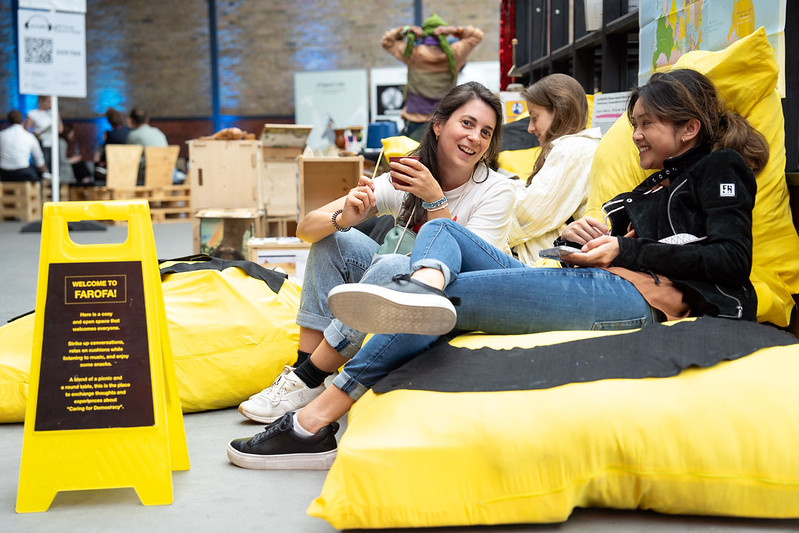

Discussion moderation: rp:FAROFA [Where Beach Vibes Meet Democracy Drive](https://24.re-publica.com/de/session/rpfarofa-where-beach-vibes-meet-democracy-drive-rethink-democracy-cooperation-care-cushions.html) rethink Democracy, Cooperation & Care from cushions. Berlin, 2024. FAROFA is a cosy and open space that welcomes everyone. Strike up conversations, relax on cushions while listening to music, and enjoy some snacks. A blend of a picnic and a round table, this is the place to exchange thoughts and experiences about "Caring for Democracy" while having a great time.

---

## re:publica 23

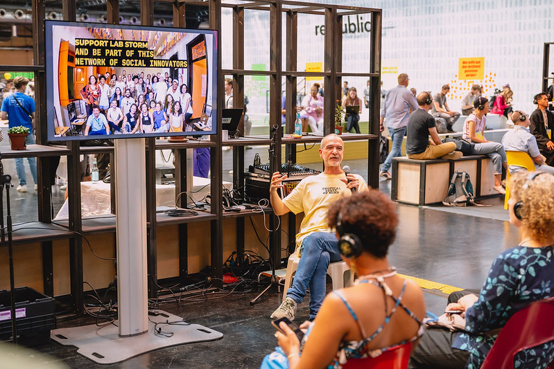

Panel presentation: [Climate Change - LabStorm](https://re-publica.com/en/node/1811). Berlin, 2023. Celebrating the impacts of the Global South Maker Community to mitigate climate change effects locally! Labstorm invited 30 people of different ages, classes, genders, and ethnicities from Brazil to a citizen laboratory focused on generating citizen innovation prototypes to combat the climate emergency.

---

## re:publica 22

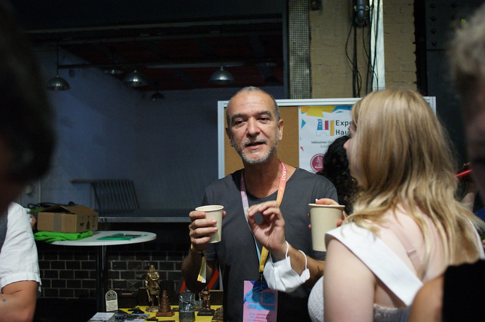

Panel presentation: Open Citizen Social Science Meetup: [How to shape an inclusive open citizen social science landscape](https://22.re-publica.com/de/session/open-citizen-social-science-meetup-how-shape-inclusive-open-citizen-social-science.html). Berlin, 2022. We invite all people involved in Citizen Social Science, but also Open Science and Citizen Science for a meetup to exchange perspectives and ideas during re:publica. The intention of this meetup is to share our different entry points into the field and to share experiences in regards to preventing eurcentric and post-colonial nuances in our work.

---
## Mozilla Festival 2021

<iframe width="560" height="315" src="https://www.youtube.com/embed/WdksAr_oVr4?controls=0" title="YouTube video player" frameborder="0" allow="accelerometer; autoplay; clipboard-write; encrypted-media; gyroscope; picture-in-picture; web-share" allowfullscreen></iframe>

Open-source technology and principles have been a potent force in slowing the spread of a deadly virus. Presenting the Careables experience.

[Open Source & the Pandemic: A Dialogues & Debates panel](https://schedule.mozillafestival.org/session/TYN3ZA-1)

---

## VII FAEL

<iframe width="560" height="315" src="https://www.youtube.com/embed/sbN4WKXq8B4?si=fB8mL4xKQuxf5kI1" title="YouTube video player" frameborder="0" allow="accelerometer; autoplay; clipboard-write; encrypted-media; gyroscope; picture-in-picture; web-share" referrerpolicy="strict-origin-when-cross-origin" allowfullscreen></iframe>

November 2020

Academic Fórum of Ludic Studies - Federal University of Rio de Janeiro

---

## CADUS Debate! Making in Times of COVID

<iframe width="560" height="315" src="https://app.media.ccc.de/v/cadusdebate-16-making-in-times-of-COVID-19/oembed" frameborder="0" allowfullscreen></iframe>

Debate visits Brazil! The makerspace [Casa Criatura](https://casacriatura.com/) in Olinda produced thousands of pieces of PPE (personal protective equipment) by mixing open, globally designed products with local practices, and donating it to local indigenous health authorities, Afro-Brazilian traditional communities and public hospitals. The makerspace also developed an open-source aerosol box with physicists and teachers from reference hospitals in the region, igniting a community of makers and healthcare professionals around it. And most importantly, the _demunis_, the ordinary citizens with community obligations, received support, too—the overarching question accompanying all these activities is how communities can better care for themselves during pandemics.

---

## Health, care and technology: a timeless relationship.

<iframe width="560" height="315" src="https://www.youtube.com/embed/iv-3bWFRRZ4?si=sX_Tc-S9ZanE1tO4" title="YouTube video player" frameborder="0" allow="accelerometer; autoplay; clipboard-write; encrypted-media; gyroscope; picture-in-picture; web-share" referrerpolicy="strict-origin-when-cross-origin" allowfullscreen></iframe>

Co-organisation and co-moderation of a series of remote meetings regarding the Covid-19 Pandemic and beyond. As part of [Careables](http://thisismy.art.br/careables-latin-america/) project, "We want to learn and further develop from the experience of responding to the pandemic that connected agents from the public, private sectors and civil society. We want to explore the times and their related actions and combine the past, the present and the future in a digitalised living space."

---

## DOTS - The Impact Summit

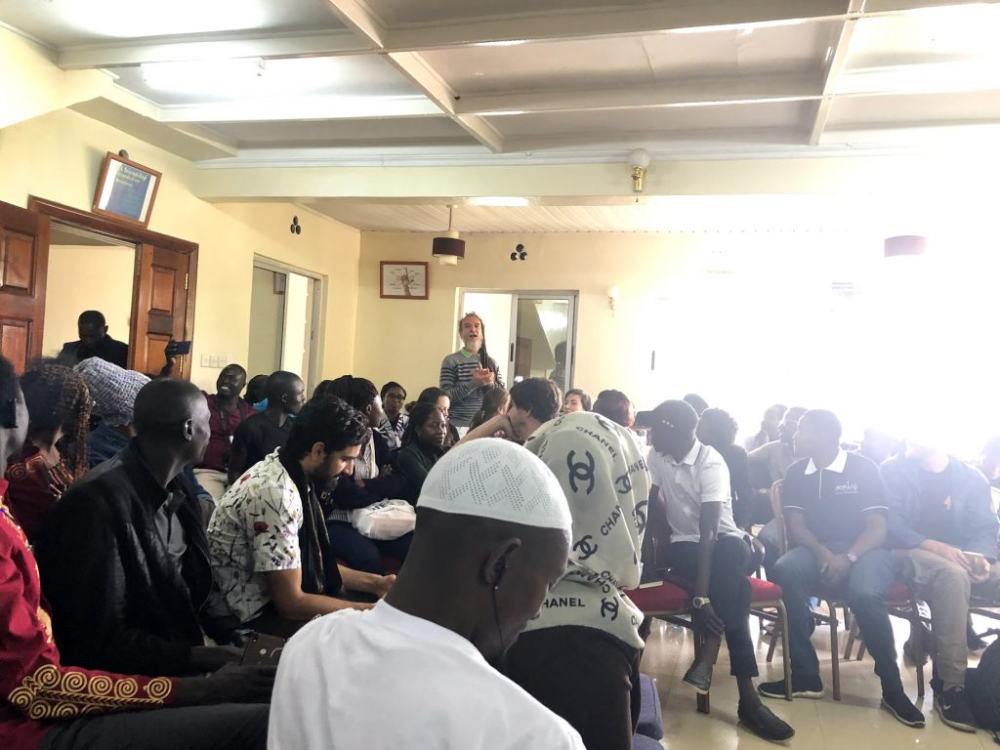

Debate on the topic of [Sustainable making](https://www.globalinnovationgathering.org/dots/) in the city of Nakuru, Kenia, in December 2019. DOTS brings together a broad range of knowledge-sharing, entrepreneurial and open-innovation activists from across East Africa and beyond to cross-mentor and explore new modus operandi across

---

## re:publica 18

<iframe width="560" height="315" src="https://www.youtube.com/embed/VzM575nZHRM?si=mygrkhbMXwK5p_Fw" title="YouTube video player" frameborder="0" allow="accelerometer; autoplay; clipboard-write; encrypted-media; gyroscope; picture-in-picture; web-share" referrerpolicy="strict-origin-when-cross-origin" allowfullscreen></iframe>

Programming is the new literacy. Learning how to code is now an integral part of most schools' curriculum. In the global south, different models are being used to improve youth skills for the future of work and the work-less ages to come. What are the different perspectives from Latin America, Philipines and Ghana?

Moderator on the panel [Youth skills for the future of work(less) on the global south](https://18.re-publica.com/de/session/youth-skills-future-workless-global-south), Berlin, 2018.

---

## Amazônia Interconectada

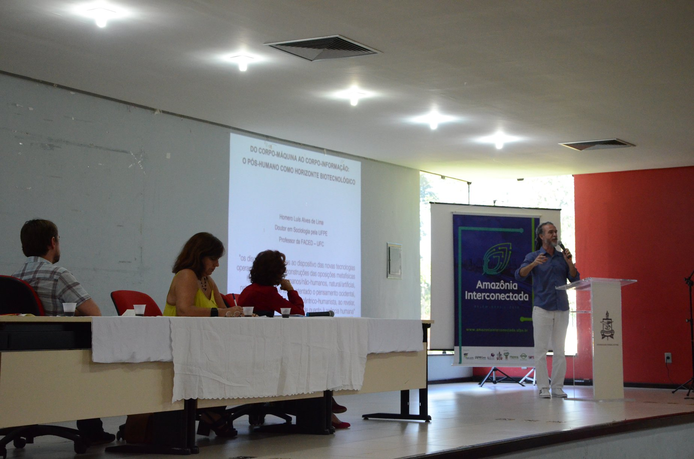

Presentation during the Innovation and Traditional Cultures opening panel. The International Conference promoted by the Federal University of Pará foments discussions about the possibilities of Amazon regional development from a technological perspective but focusing on preserving nature and local cultures.

---

## re:publica 17

<iframe width="560" height="315" src="https://www.youtube.com/embed/mzF5KQSTV2A?si=M6qz0GpIkZXw3JTY" title="YouTube video player" frameborder="0" allow="accelerometer; autoplay; clipboard-write; encrypted-media; gyroscope; picture-in-picture; web-share" referrerpolicy="strict-origin-when-cross-origin" allowfullscreen></iframe>

Debate on the panel [Creating organizations of/for the commons](https://re-publica.com/en/session/creating-organizations-offor-commons), Berlin, 2017. New challenges demand new institutions and forms of organisation. How is civil society rethinking its forms of representation and organisation? What new models are emerging? In this session, we want to discuss the urgency of reinventing the institutions from a civil society perspective and bring experiments that point out different paths.

---

## #peacehackcamp

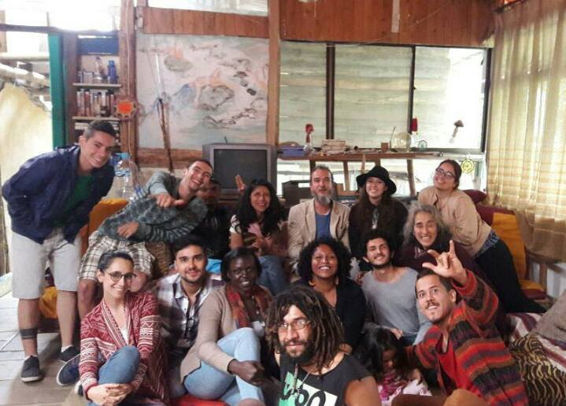

Different panels presentation at Salento, Colômbia, 2016. Peace Hack Camps are intensive media literacy and inter-communal peace-building workshops lasting several days. They tap into open source tools and media for their ability to promote collaborative enterprise in learning and innovation, foster mutually beneficial interaction among communities, enable shared ownership and effectively distribute gained knowledge between members of formerly hostile groups.

[https://www.facebook.com/hashtag/peacehackcamp](https://www.facebook.com/hashtag/peacehackcamp)

---

## Resilient Cities, Smart Citizens

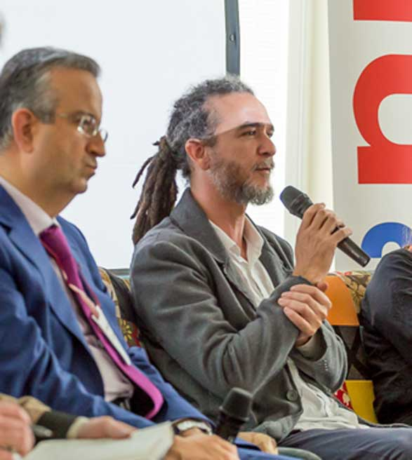

Debate "Fostering Communities to tackle innovation", Rio de Janeiro, 2016. [Resilient Cities, Smart Citizen](https://www.swissnexbrazil.org/event/resilient-cities-smart-citizens/) was a five-day workshop followed by a one-day seminar about enabling citizens to make their cities more resilient to the physical, social, and economic challenges of the 21st century. The event was produced by the Dutch Consulate of Rio de Janeiro, which currently chairs the European Union, in partnership with IED Rio, Waag Society, Prefeitura do Rio de Janeiro, Swissnex Brazil and Olabi to gather designers, decision-makers and entrepreneurs for a week of creativity, design, innovation and technology.

---

## RedBull Basement Festival

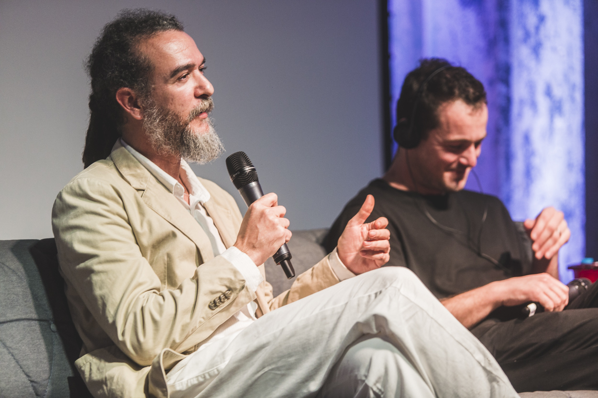

Panel presentation on [Open Cities](https://www.redbull.com/br-pt/festival-red-bull-basement-rola-neste-sabado), São Paulo, 2016. Joined the “Cidades Abertas” panel to explore how urban spaces can be reimagined through open-source thinking and collaborative innovation

---

## Critical Dialogue Series

<iframe src="https://player.vimeo.com/video/140911684?badge=0&amp;autopause=0&amp;player_id=0&amp;app_id=58479" width="560" height="315" frameborder="0" allow="autoplay; fullscreen; picture-in-picture; clipboard-write; encrypted-media; web-share" referrerpolicy="strict-origin-when-cross-origin" title="The New Urban Agenda &#039;on the ground&#039;. #2 Different Urbanisations | Lab Talk | 18/09/15 | Part 2: Keynote Ricardo Ruiz Freire"></iframe> 

Different URBANISATIONS, Berlin, 2015. [This dialogue](http://criticalurbanagenda.de/different-urbanisations) focuses on the role and limits of import/export of knowledge, technology and urbanisation patterns between different regions of the world, and questions how 'culturally different' the processes of urbanisation are/should be.

---

## re:publica 15

<iframe width="560" height="315" src="https://www.youtube.com/embed/f4D61F_3ffU?si=SXVrLhhldXBpNpFM" title="YouTube video player" frameborder="0" allow="accelerometer; autoplay; clipboard-write; encrypted-media; gyroscope; picture-in-picture; web-share" referrerpolicy="strict-origin-when-cross-origin" allowfullscreen></iframe>

Panel presentation [SERENDIPITY CITY – INFORMAL URBAN PLANNING AND SOCIAL ARCHITECTURE](https://15.re-publica.com/en/session/serendipity-city-informal-urban-planning-and-social-architecture.html), Berlin, 2015. The urban environment is the expression of modern life. Cities grow fast, dynamically and not always in the way governments plan. In particular in developing countries, formal city planning seems to be in a race with informal urban development, settlements like so called slums that may serve the immediate needs of their inhabitants, but clash with the plans of those in power.

---

## Itaú Cultural

<iframe width="560" height="315" src="https://www.youtube.com/embed/OBf52dx8b-g?si=S1kgb3ehM2UaN0E-" title="YouTube video player" frameborder="0" allow="accelerometer; autoplay; clipboard-write; encrypted-media; gyroscope; picture-in-picture; web-share" referrerpolicy="strict-origin-when-cross-origin" allowfullscreen></iframe>

Panel about Free and Tactical Media.  
[Onda Cidadã Festival](https://www.itaucultural.org.br/o-que-os-motiva-cobertura-colaborativa-do-3o-forum-onda-cidada-2012?p=2), São Paulo, 2012. A vibrant forum that celebrates and supports autonomous media and cultural activism across Brazil. Through debates, interviews, and collaborative coverage, the event highlights grassroots initiatives and explores themes like sustainability, digital inclusion, and creative resistance. The festival also showcases a national mapping of over 300 independent media projects, fostering dialogue and visibility for voices often overlooked in mainstream narratives

---

## MMKamp

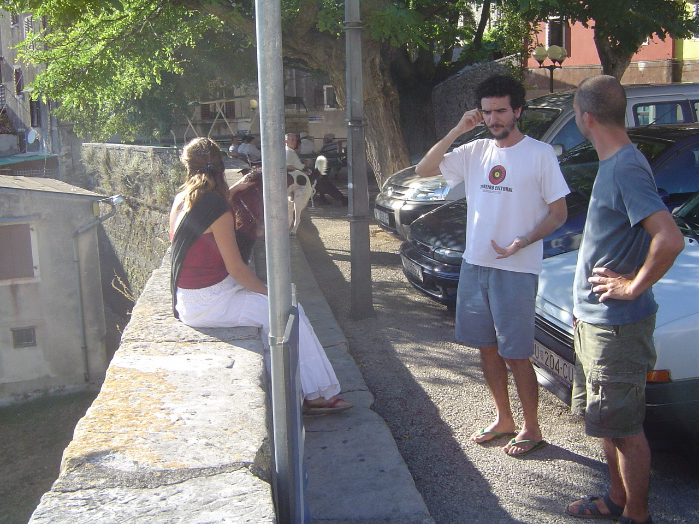

Lecture and workshop on Free Radio and Arts, Croatia, 2006. MMKamp is an international “artist residency” project based on collaboration between non-profit organizations, artists, tactical media activists and ones who don’t know yet what they are and don’t care much. MMKamp concept is an art and new media laboratory, platform for researching, new media experimenting and developing new artistic and communication forms, through self-initiated collaboration among international artists and new media workers.

Visit project's [archive](https://web.archive.org/web/20100305063510/http://gentlejunk.net/mmkamp06/index.php?option=com_content&task=blogcategory&id=3&Itemid=33&lang=hr) and [web page](http://mmkamp.gentlejunk.net/about/)

---

## Wizards of OS

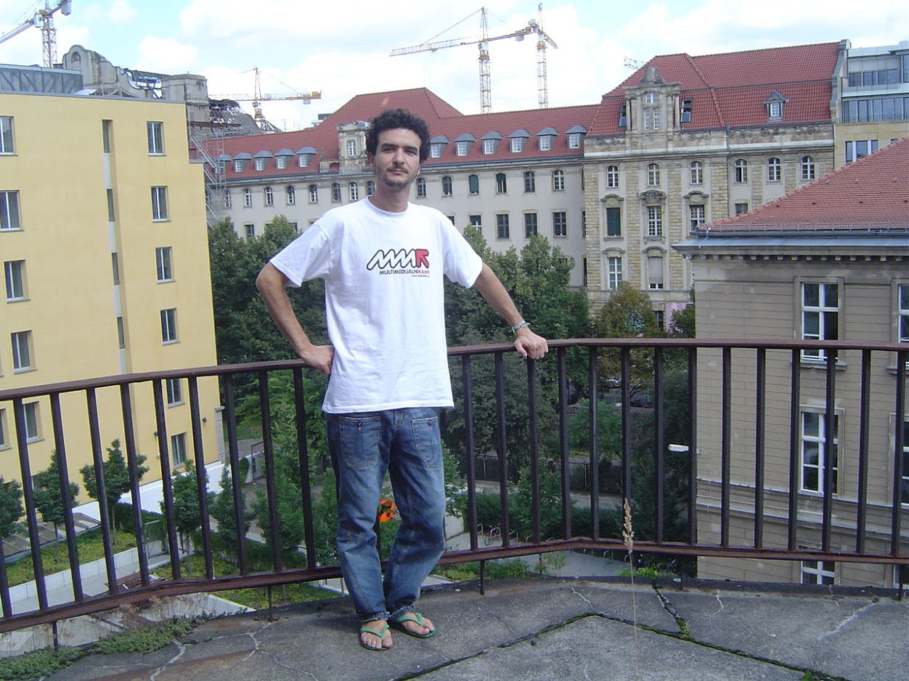

**mimoSa** - **Urban Intervention and Information Correction Machine**. Panel presenting a residency at Tesla Museum. Berlin, 2006. Conclusion of a residency at Tesla Museum by presenting a mapping of Brazilian new media groups, festivals, arts and activism, connecting independent, governmental, community and private initiatives.

Visit [Wizards of OS website](http://www.wizards-of-os.org/programm/specials/mimosa.html)

---

## Cybersalon

Panel Presentation about [Brazilian Open Source Software & Copyleft](http://lewissykes.info/archives/cybersalon/past.html#gilbertogil) London, 2005. This Cybersalon discussed the Brazilian government's open source software project and its support for copyleft at the forthcoming WSIS conference on 18-19th November in Tunis, Tunisia. WSIS is the United Nations World Summit on the Information Society

---

## Alt Law Forum
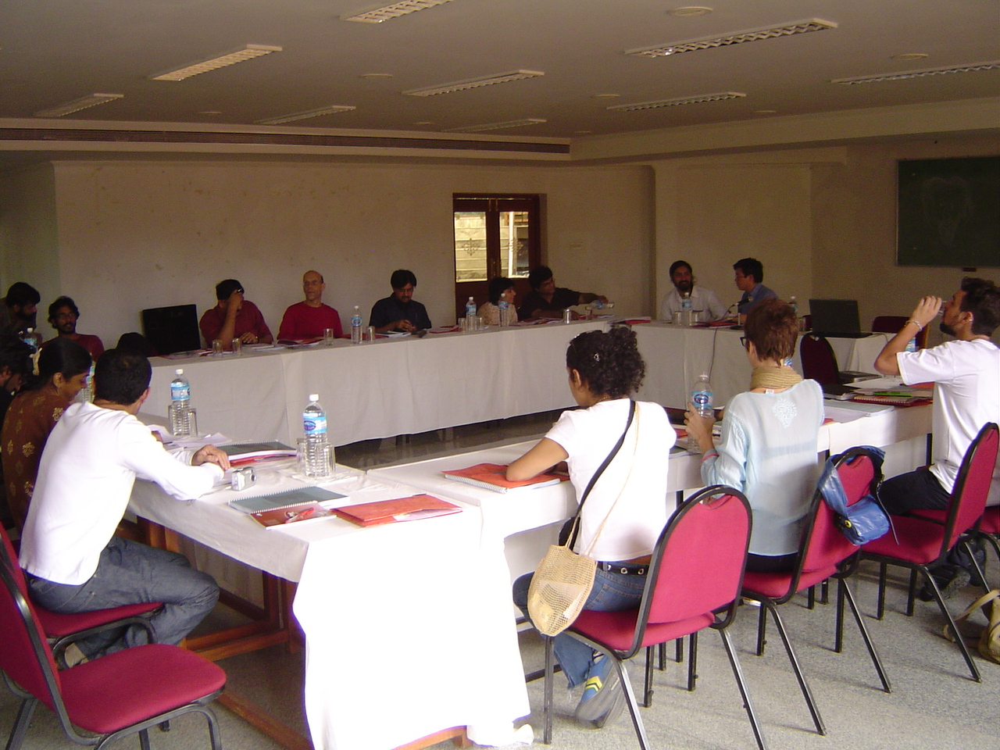

Participant to present [Midia Tatica Brasil](http://thisismy.art.br/midia-tatica-brasil/) in Bangalore, India, 2004, a partnership between Sarai (India) and Waag Society (Netherlands). The Alternative Law Forum (ALF) is a collective of lawyers based in Bengaluru, India, founded in March 2000. It was created to promote an alternative, socially engaged practice of law that addresses issues of social and economic injustice. ALF integrates litigation, critical research, pedagogy, and advocacy, often working with marginalized communities and grassroots organizations. Their work spans areas like gender and sexuality rights, labor and employment, environmental justice, and constitutional law. They also emphasize interdisciplinary approaches and creative methods to make legal knowledge more accessible and impactful

