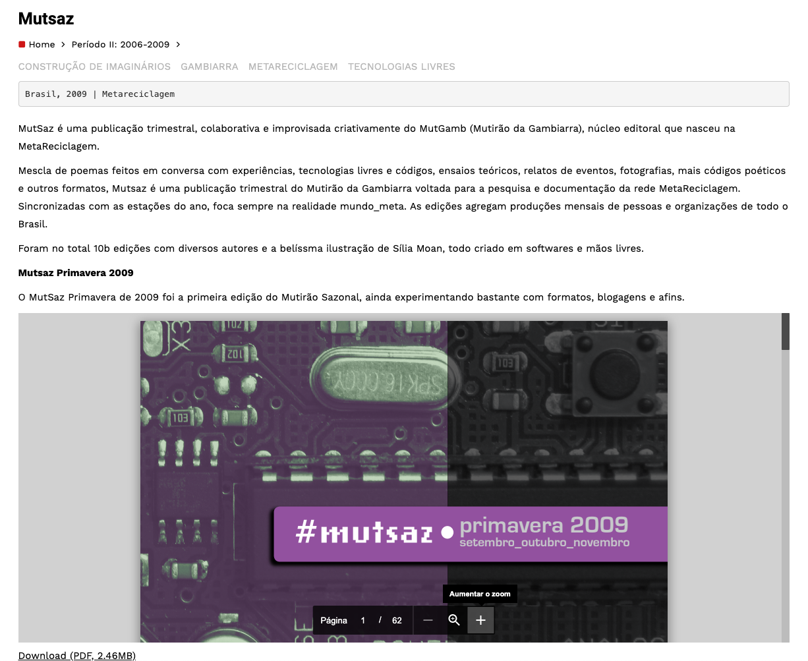
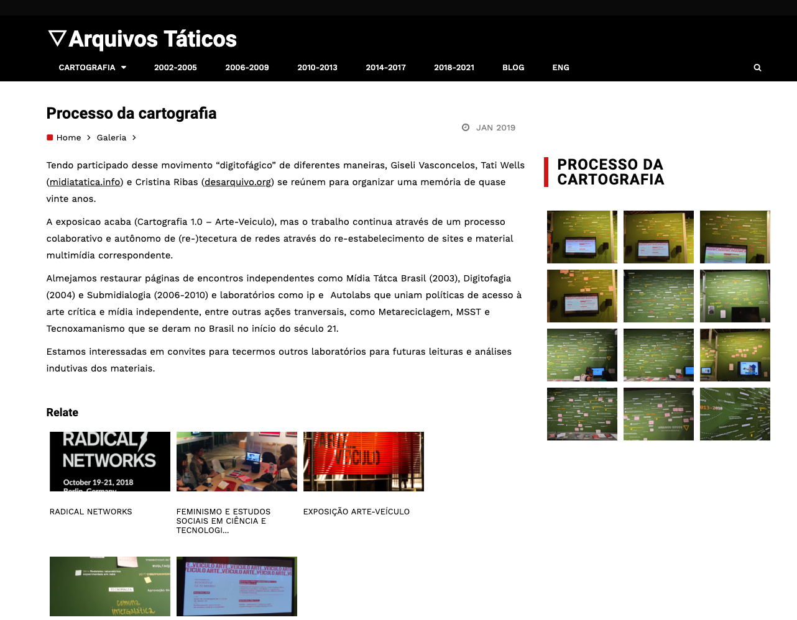
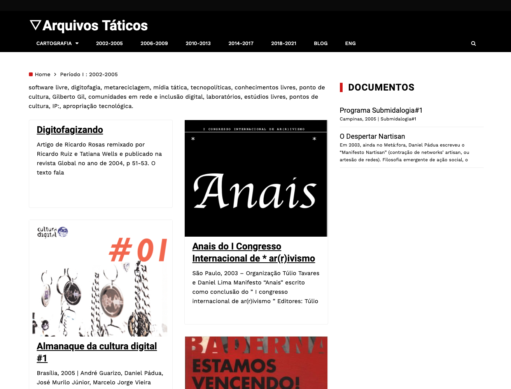
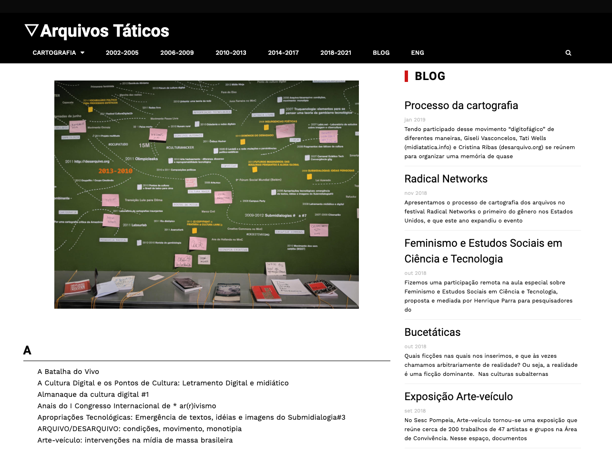

<small>[Texts](../texts.html) | [Lectures](../lectures.html) | [Projects](../projects.html) | [Curations](../curation.html) | [Designs](../designs.html) | [Teachings](../teachings.html) | [Awards](../awards.html) | <a href="https://readruiz.medium.com/" target="_blank">Blog</a></small>

# Arquivos Táticos

Web Development for exhibition's online platform

    

    

    

    

Tactical archives compile cartography of books and publications on a platform for online consultation, accompanied in the shows by an in-process timeline. In this timeline, we see texts, essays and sites that show us the political context and the technological changes that marked events, meetings, crosses between art and activism, as well as institutional paths of the development of networks in Brazil.

Visit [https://midiatatica.desarquivo.org/](https://midiatatica.desarquivo.org/)
