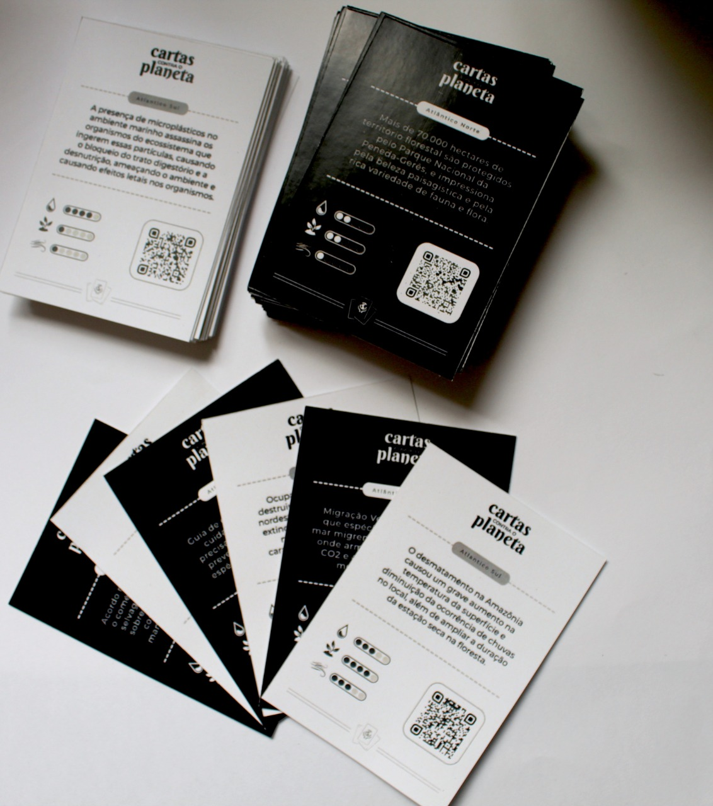
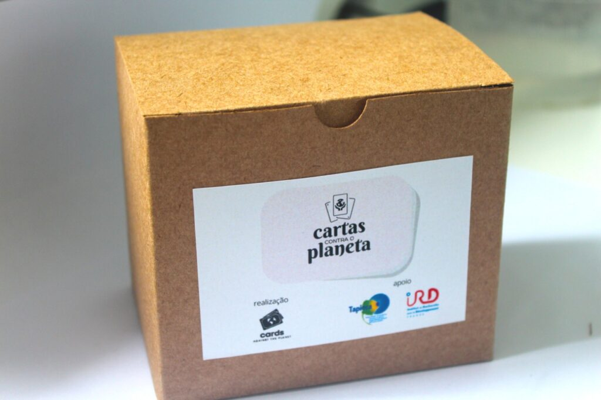
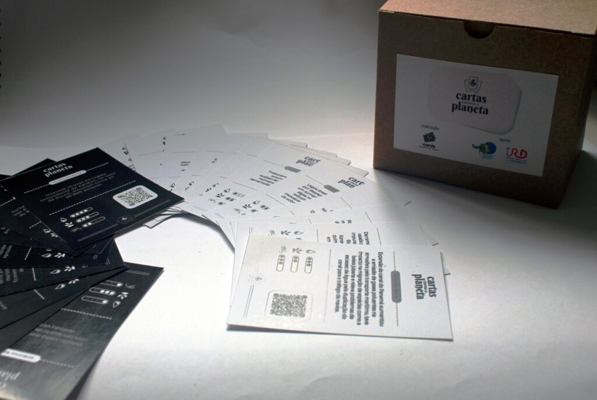

<small>[Texts](../texts.html) | [Lectures](../lectures.html) | [Projects](../projects.html) | [Curations](../curation.html) | [Designs](../designs.html) | [Teachings](../teachings.html) | [Awards](../awards.html) | <a href="https://readruiz.medium.com/" target="_blank">Blog</a></small>

# Cards Against the Planet

Project Manager for the multiplayer strategy card game presents problems faced by nature resulting from human activity. Together, the players embody the planet and turn cards to mitigate the pollution caused in the air, soil, and oceans.

    

Cards Against the Planet is a game about the environment in which players are compelled to tackle global climate change threats.

Know more and download your card deck at [naturabit.itch.io/cards-against-the-planet](https://naturabit.itch.io/cards-against-the-planet)
