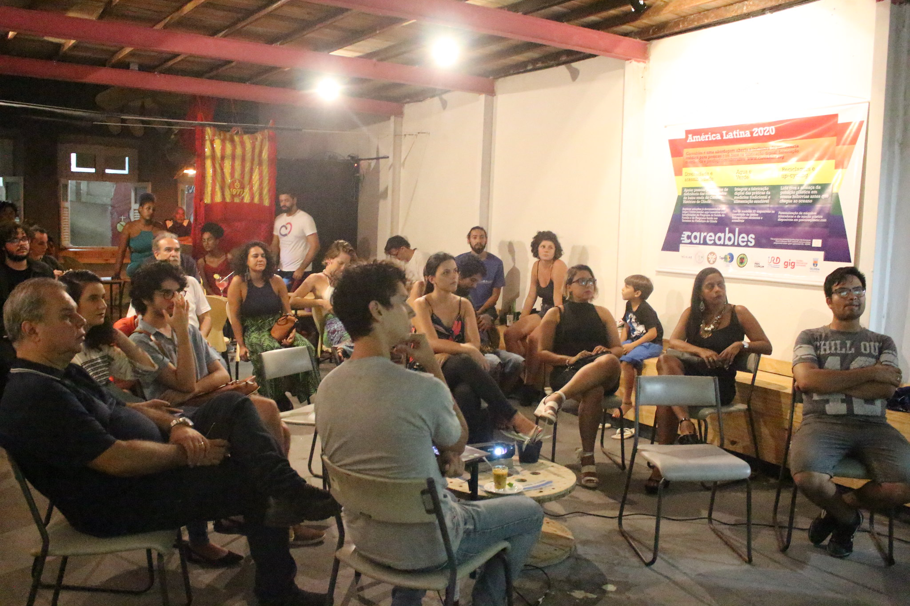
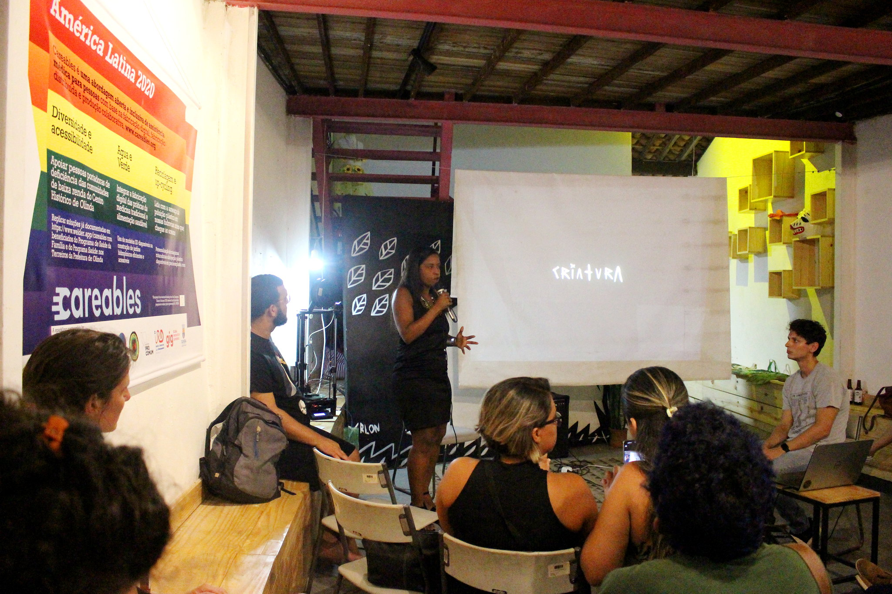
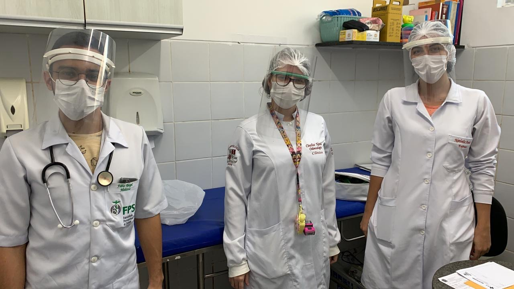
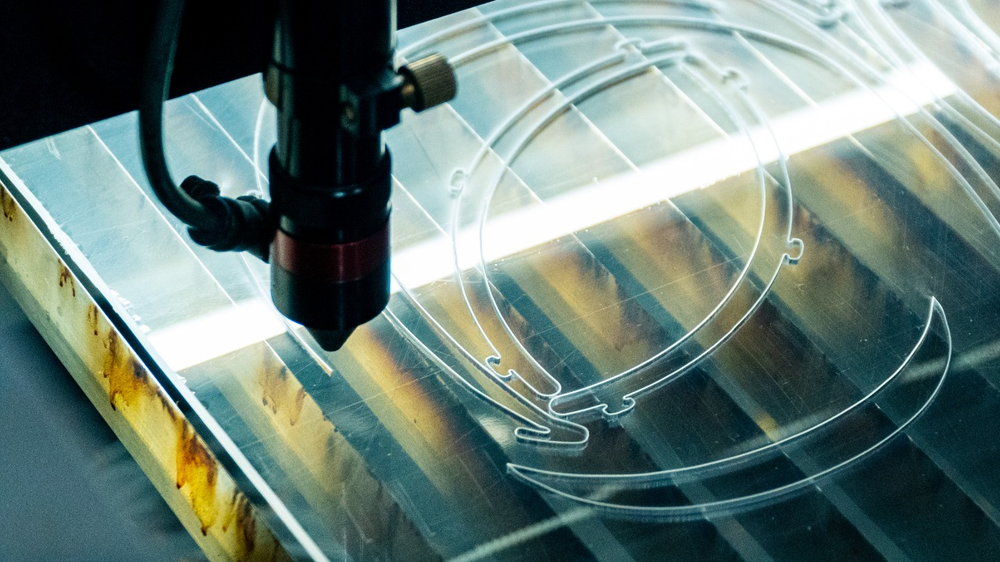

<small>[Texts](../texts.html) | [Lectures](../lectures.html) | [Projects](../projects.html) | [Curations](../curation.html) | [Designs](../designs.html) | [Teachings](../teachings.html) | [Awards](../awards.html) | <a href="https://readruiz.medium.com/" target="_blank">Blog</a></small>

# Careables

Local consultancy for the an international collaboration platform that allows citizens to design and deliver people-centered health products.

<iframe width="560" height="315" src="https://www.youtube.com/embed/x_duDPdcKMk?si=QOaG7_KNsi2jUueG" title="YouTube video player" frameborder="0" allow="accelerometer; autoplay; clipboard-write; encrypted-media; gyroscope; picture-in-picture; web-share" referrerpolicy="strict-origin-when-cross-origin" allowfullscreen></iframe>
    
Careables is a community of manufacturers and users of open source collaborative hardware innovations that can be easily replicated globally via 3D printing and other forms of digital and manual manufacturing.

    

The purpose of this platform is to engage, unite and connect communities interested in the field of open source healthcare solutions. Engagement focuses on local levels and existing global activities.

    

Different products have been built for the [Covid-19 pandemic](https://medium.com/@readruiz/the-first-month-of-a-maker-lab-against-covid-19-in-northeastern-brazil-121d161be705).

[Know more](http://careables.org)
