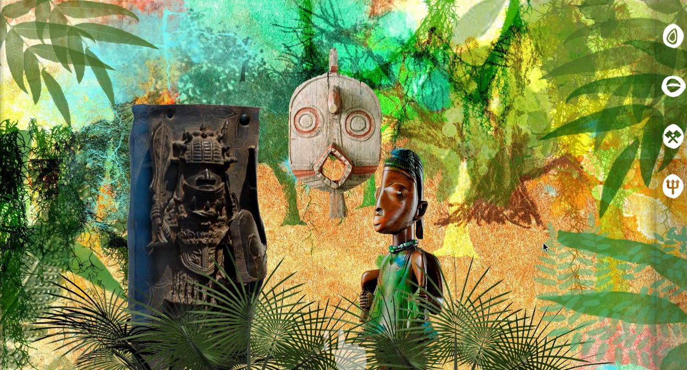
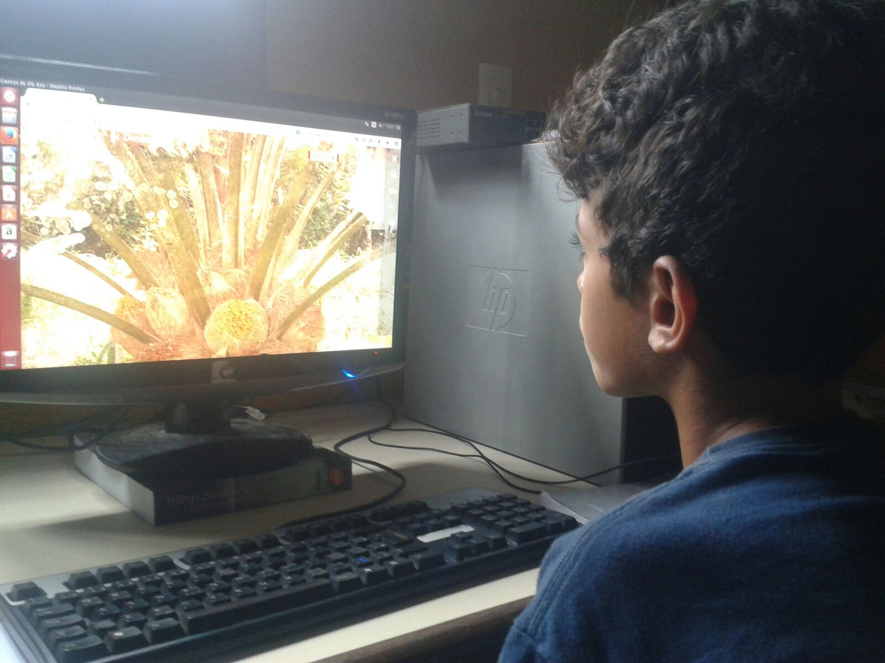

<small>[Texts](../texts.html) | [Lectures](../lectures.html) | [Projects](../projects.html) | [Curations](../curation.html) | [Designs](../designs.html) | [Teachings](../teachings.html) | [Awards](../awards.html) | <a href="https://readruiz.medium.com/" target="_blank">Blog</a></small>

# Contos de Ifá

Co-founder and Executive director of the awarded Game Development Workshops

<iframe width="560" height="315" src="https://www.youtube.com/embed/hcawb3ieJ8c?si=jN8N7CA2gAwQ_OPK" title="YouTube video player" frameborder="0" allow="accelerometer; autoplay; clipboard-write; encrypted-media; gyroscope; picture-in-picture; web-share" referrerpolicy="strict-origin-when-cross-origin" allowfullscreen></iframe>
    
Contos de Ifá is a new media experience: an educational adventure web-game that has African-Brazilian mythology as the plot. The games are built during workshops for public school teachers focused on the use of the game as a pedagogical tool in the classroom, and methodology for the construction, together with the students, of new game-stories for the platform.

    

    

    

Visit project's [website](http://contosdeifa.com.br) and [blog](http://contosdeifa.wordpress.com)
