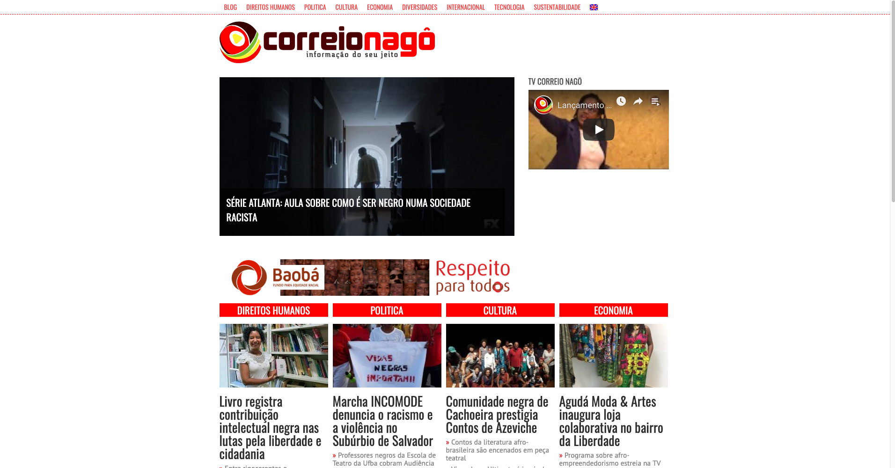
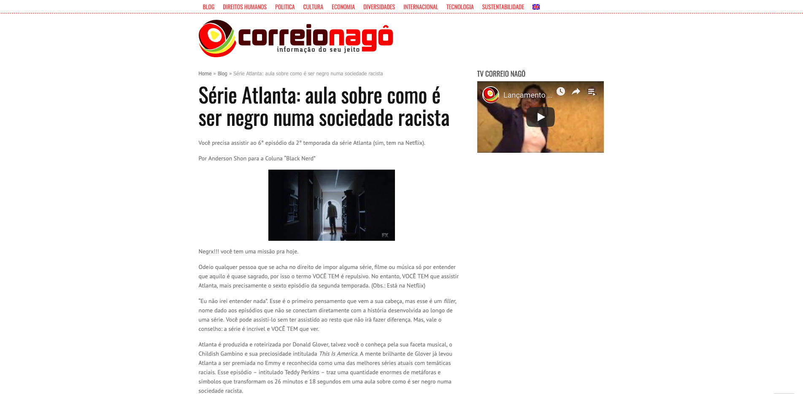

<small>[Texts](../texts.html) | [Lectures](../lectures.html) | [Projects](../projects.html) | [Curations](../curation.html) | [Designs](../designs.html) | [Teachings](../teachings.html) | [Awards](../awards.html) | <a href="https://readruiz.medium.com/" target="_blank">Blog</a></small>

# Correio Nagô

    

    

Correio Nagô is one of the largest content platforms about Brazil's black community, with correspondents in several states of Brazil and the world. Visi [https://correionago.com.br/](https://correionago.com.br/)
