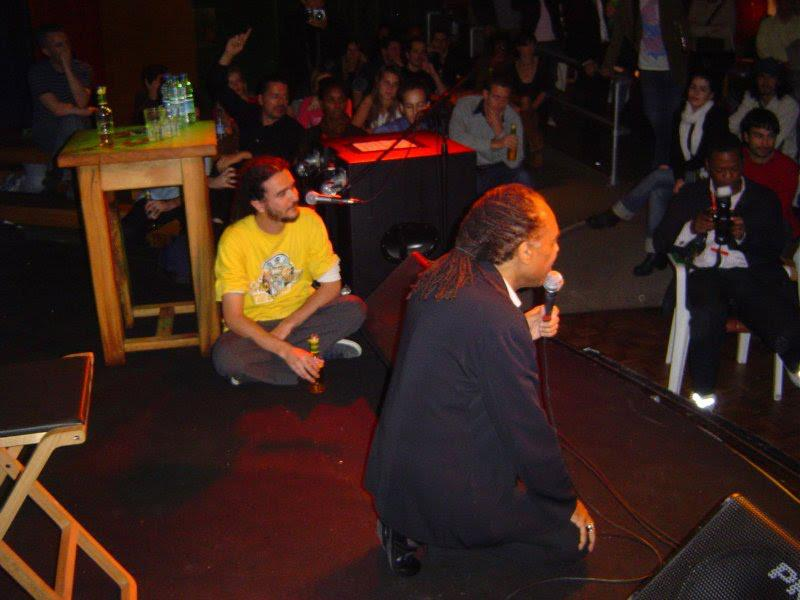

<small>[Projects](../projects.html) | [Lectures](../lectures.html) | [Teachings](../teachings.html) | [Designs](../designs.html) | [Texts](../texts.html) | [Curation](../curation.html) | [Awards](../awards.html) | <a href="https://readruiz.medium.com/" target="_blank">Blog</a></small>

Panel Presentation about [Brazilian Open Source Software & Copyleft  
](http://lewissykes.info/archives/cybersalon/past.html#gilbertogil)London, 2005

- 
    
- 
    

This Cybersalon discussed the Brazilian government's open source software project and its support for copyleft at the forthcoming WSIS conference on 18-19th November in Tunis, Tunisia. WSIS is the United Nations World Summit on the Information Society
