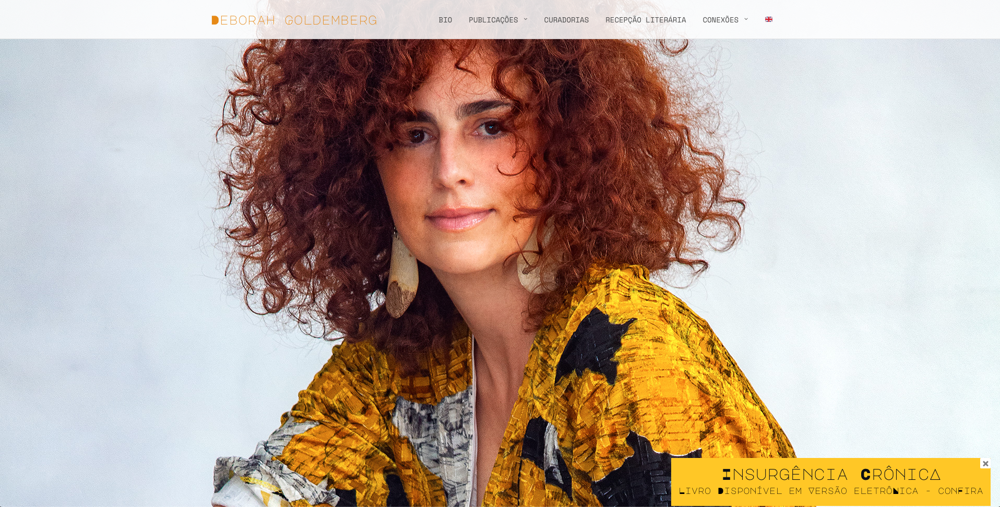
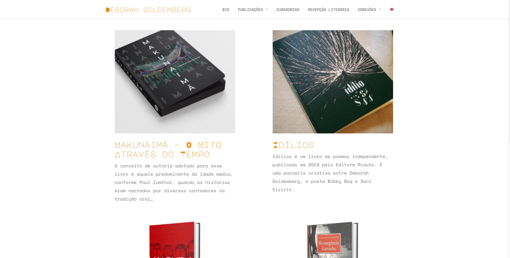
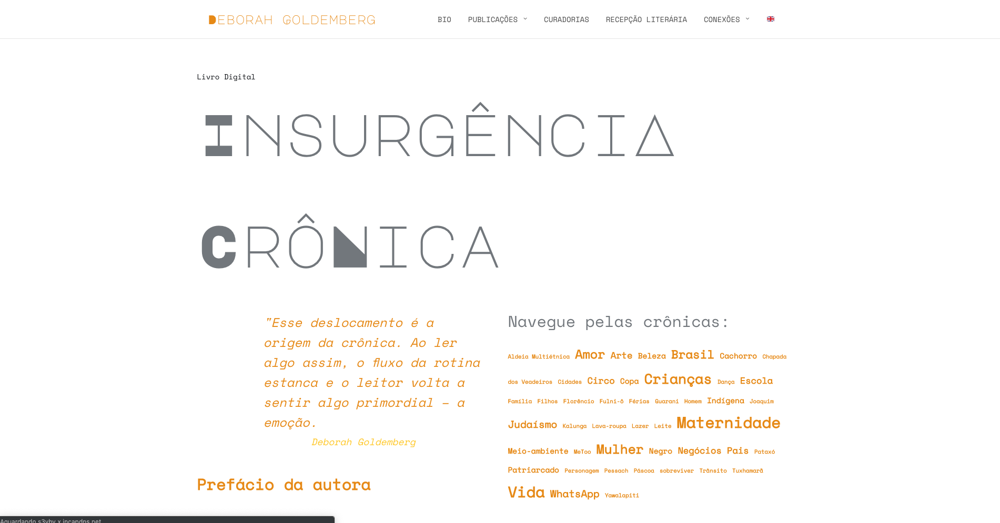
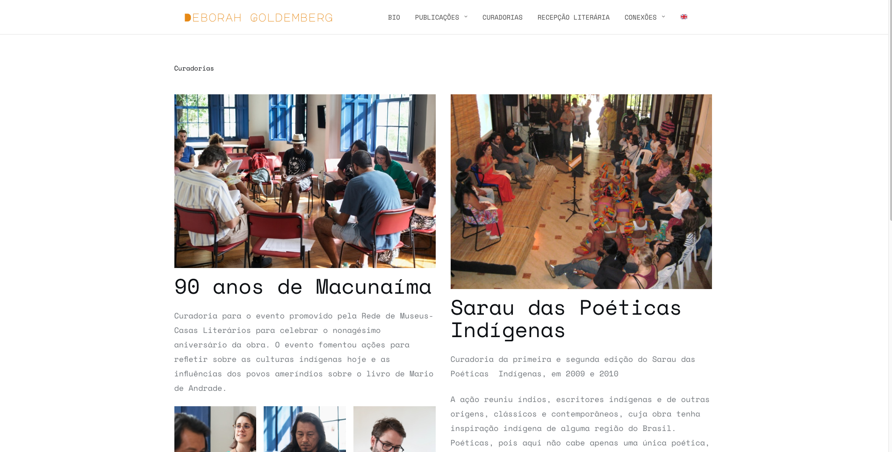

<small>[Texts](../texts.html) | [Lectures](../lectures.html) | [Projects](../projects.html) | [Curations](../curation.html) | [Designs](../designs.html) | [Teachings](../teachings.html) | [Awards](../awards.html) | <a href="https://readruiz.medium.com/" target="_blank">Blog</a></small>

# Deborah Goldemberg

Development of web platform for award-winning author Deborah Goldemberg.

    

    

    

    

Deborah Goldemberg is an anthropologist, author of Valentia (Ed. Grua, 2012), winner of PROAC of the São Paulo Government / 2011, finalist of the Jabuti and Machado de Assis Awards (National Library) 2013.

Visit [deborahgoldemberg.com](https://deborahgoldemberg.com)
