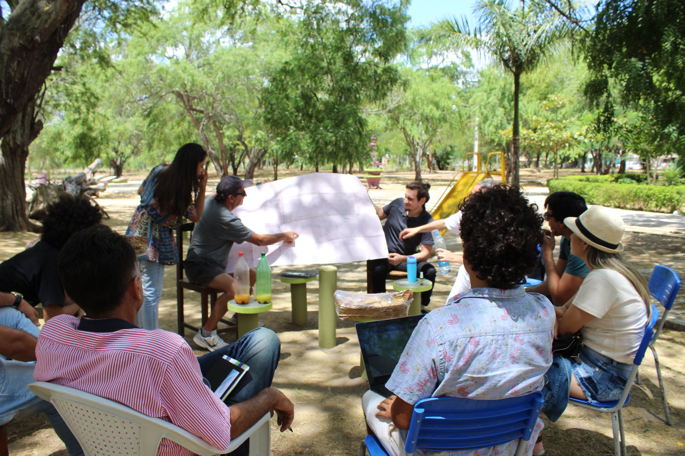
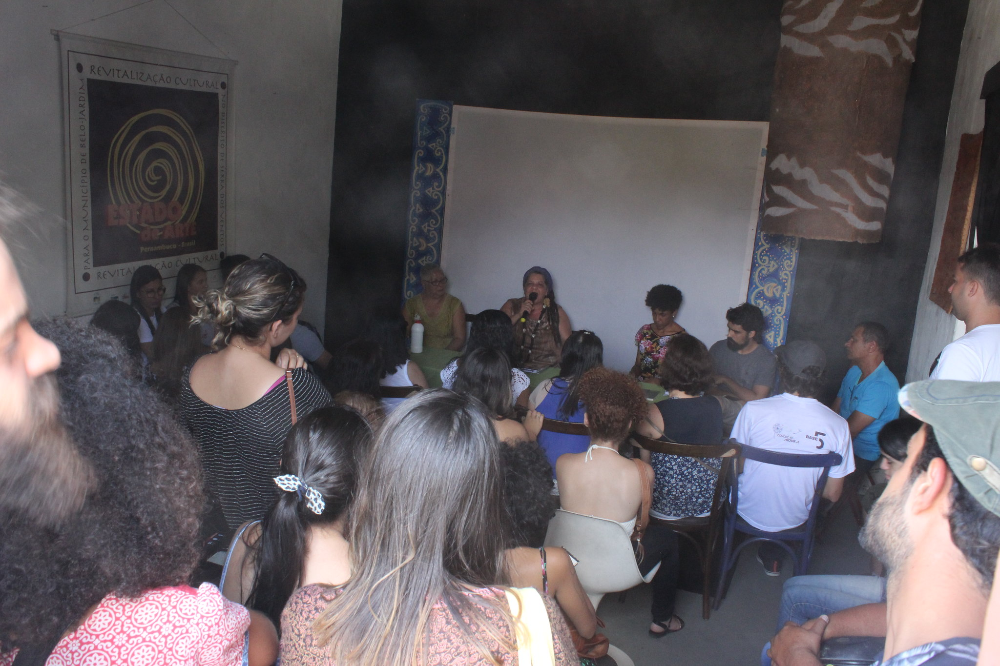
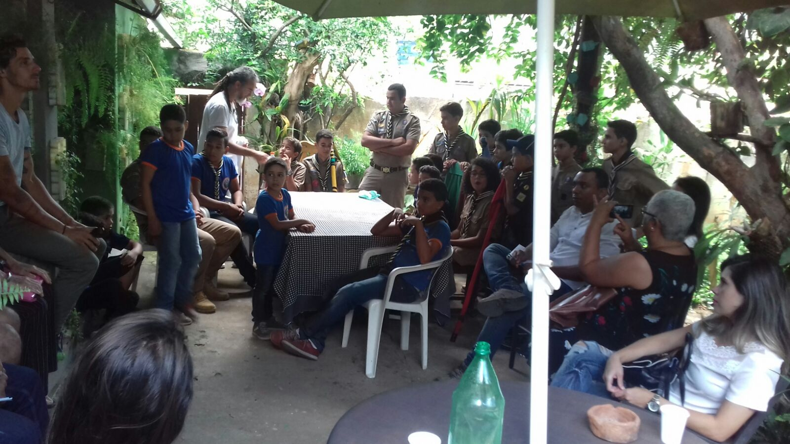
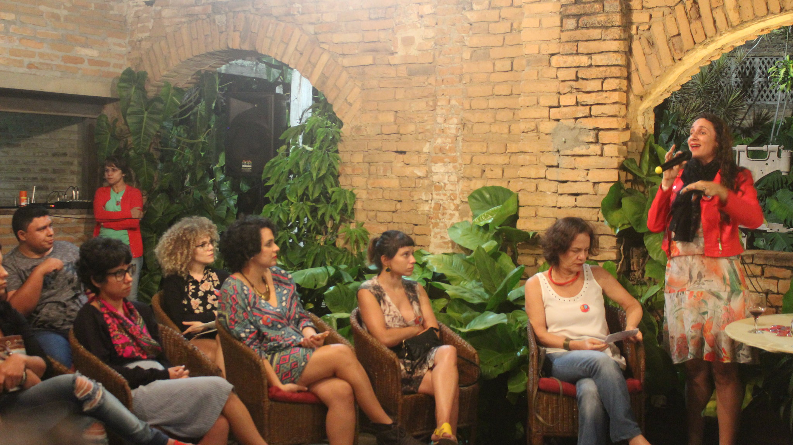

<small>[Texts](../texts.html) | [Lectures](../lectures.html) | [Projects](../projects.html) | [Curations](../curation.html) | [Designs](../designs.html) | [Teachings](../teachings.html) | [Awards](../awards.html) | <a href="https://readruiz.medium.com/" target="_blank">Blog</a></small>

# Digitologias

A series of conferences to debate, collect and manage water and sanitation data on the city of Belo Jardim

<iframe width="560" height="315" src="https://www.youtube.com/embed/ni1yj2CZasE?si=qVJqiQcvHZ1mW9y-" title="YouTube video player" frameborder="0" allow="accelerometer; autoplay; clipboard-write; encrypted-media; gyroscope; picture-in-picture; web-share" referrerpolicy="strict-origin-when-cross-origin" allowfullscreen></iframe>
    

The purpose of the conferences is to plan, together with agents from different spheres, actions that engage participants in the preparation of proposals that contribute to the territory of Belo Jardim following the United Nations - UN Sustainable Development Goals.

    

    

    

Visit project's [website](https://medium.com/@digitologias), [flickr](https://www.flickr.com/photos/140819741@N06) and [youtube](https://www.youtube.com/channel/UCF6a-D0vzUUT9r6U9vKLjkw)
