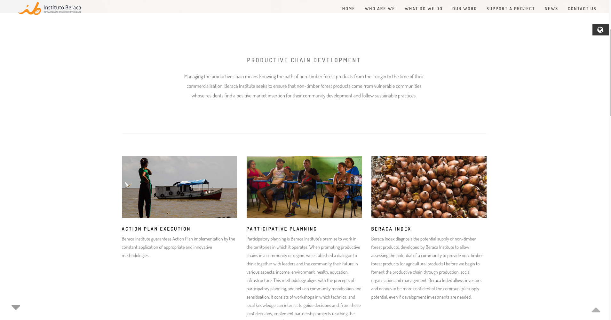
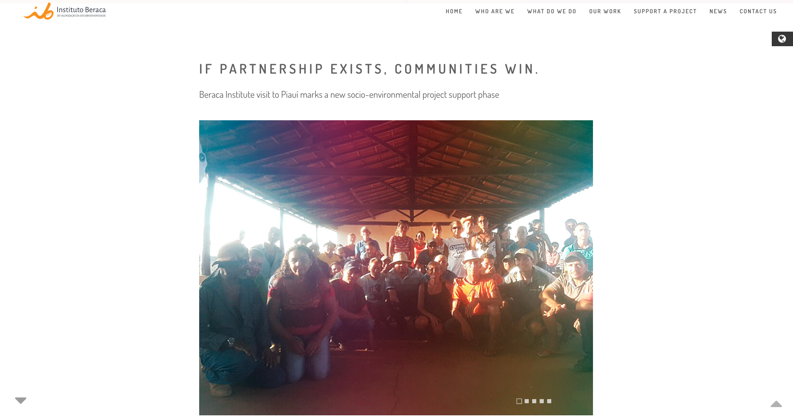
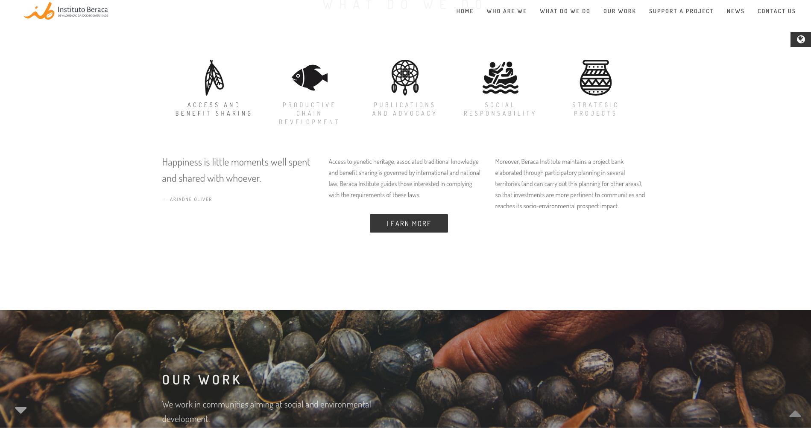
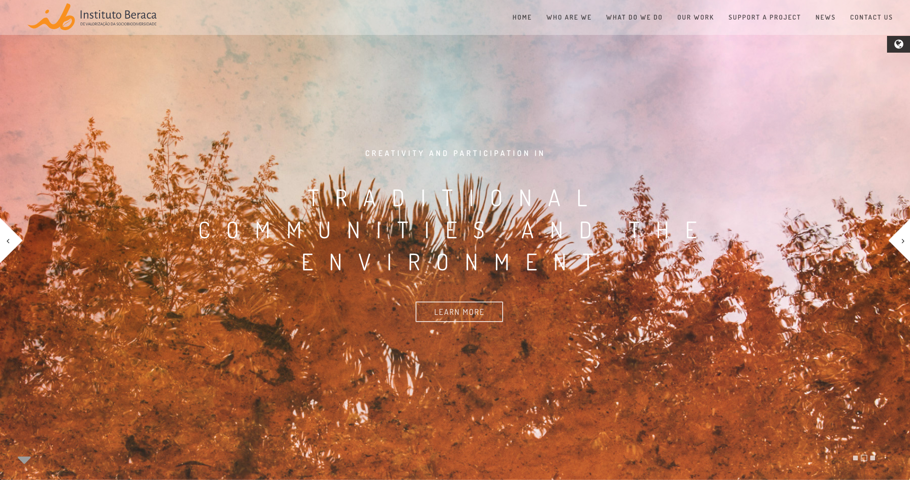

<small>[Texts](../texts.html) | [Lectures](../lectures.html) | [Projects](../projects.html) | [Curations](../curation.html) | [Designs](../designs.html) | [Teachings](../teachings.html) | [Awards](../awards.html) | <a href="https://readruiz.medium.com/" target="_blank">Blog</a></small>

# Instituto Beraca

Web Design for Instituto Beraca online platform

    

    

    

    

Beraca Institute is part of Beraca operation, a leading supply company of natural and organic ingredients composed of assets extracted from the Amazon and other Brazilian biomes.

Visit [http://www.institutoberaca.org](http://www.institutoberaca.org)
