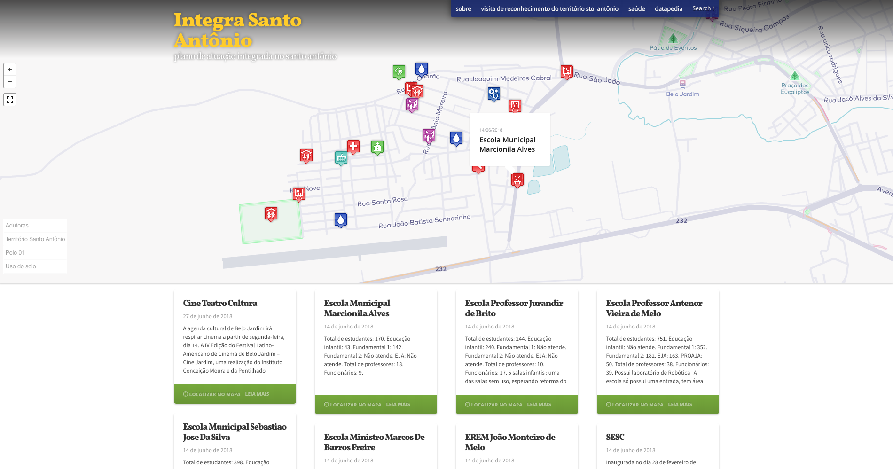
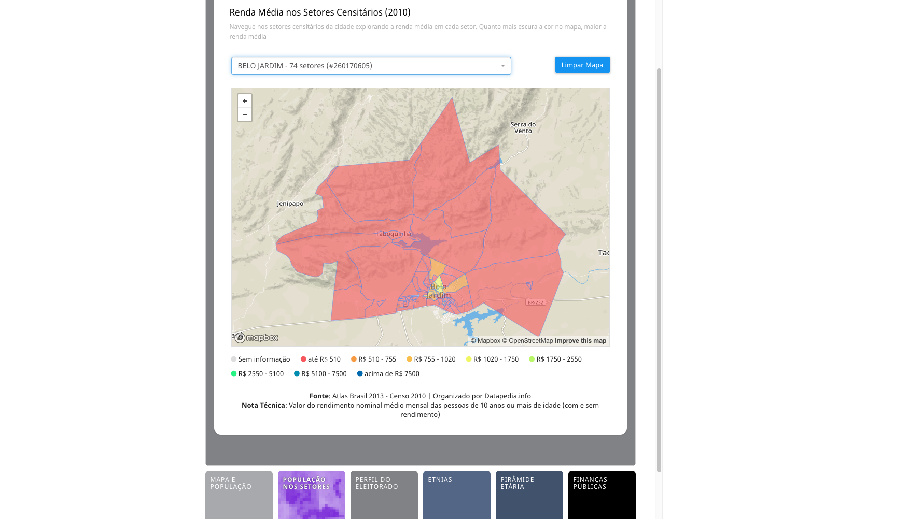

<small>[Texts](../texts.html) | [Lectures](../lectures.html) | [Projects](../projects.html) | [Curations](../curation.html) | [Designs](../designs.html) | [Teachings](../teachings.html) | [Awards](../awards.html) | <a href="https://readruiz.medium.com/" target="_blank">Blog</a></small>

# Instituto Conceiçao Moura

    

    

    

Web Development of a cartography tool to map and support public education on Belo Jardim's low-income neighbourhoods. Visit [http://mapas.icmoura.org/](http://mapas.icmoura.org/)
