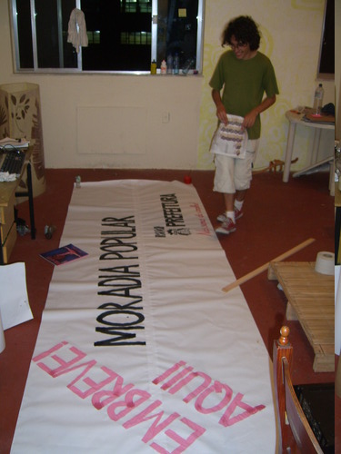
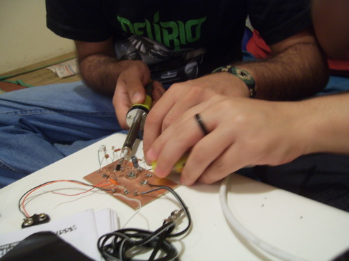
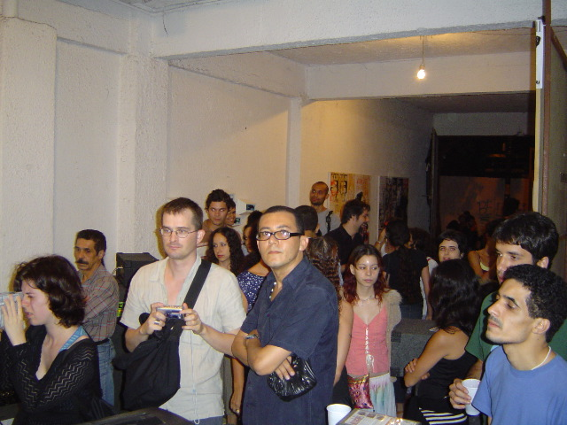
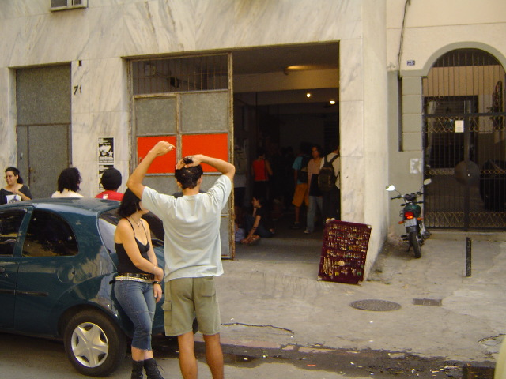
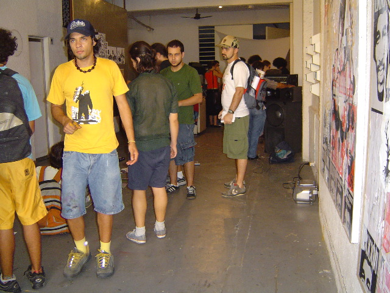

<small>[Texts](../texts.html) | [Lectures](../lectures.html) | [Projects](../projects.html) | [Curations](../curation.html) | [Designs](../designs.html) | [Teachings](../teachings.html) | [Awards](../awards.html) | <a href="https://readruiz.medium.com/" target="_blank">Blog</a></small>

# IP:// - Public Interface

Co-foundation of the collective

- 
    
- 
    
- 
    
- 
    

Meta-collective, a temporary autonomous zone that strengthened non-hierarchical processes and zones of coexistence and collaboration between different collectives, movements and people. Started in 2004 in Lapa, Rio de Janeiro, but moved over time to Morro da Mangueira, Morro do Turano and Morro da Conceição

visit [project's website](https://midiatatica.info/blog/2018/10/16/ip/)
