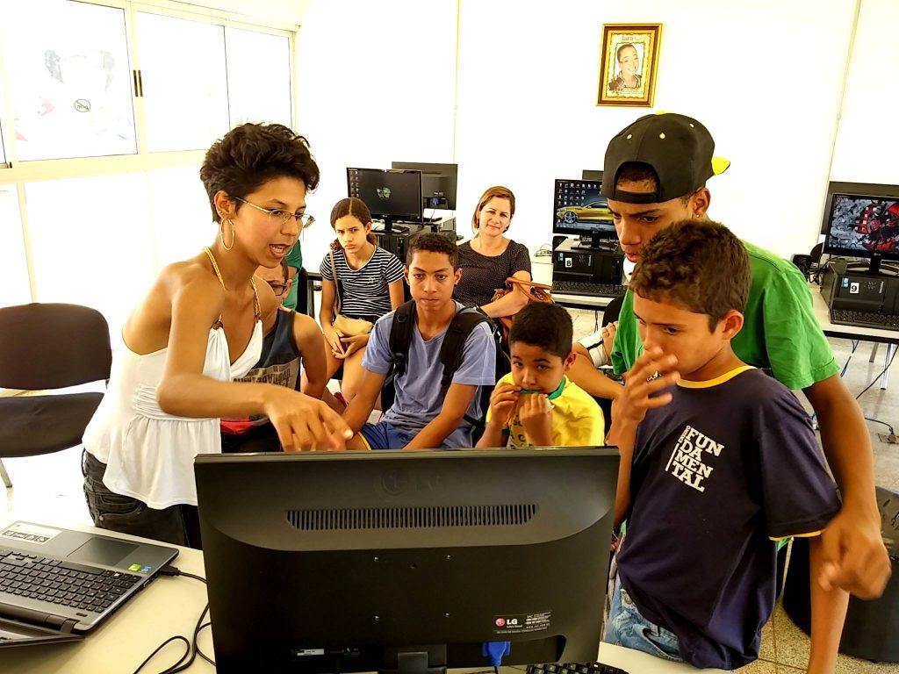
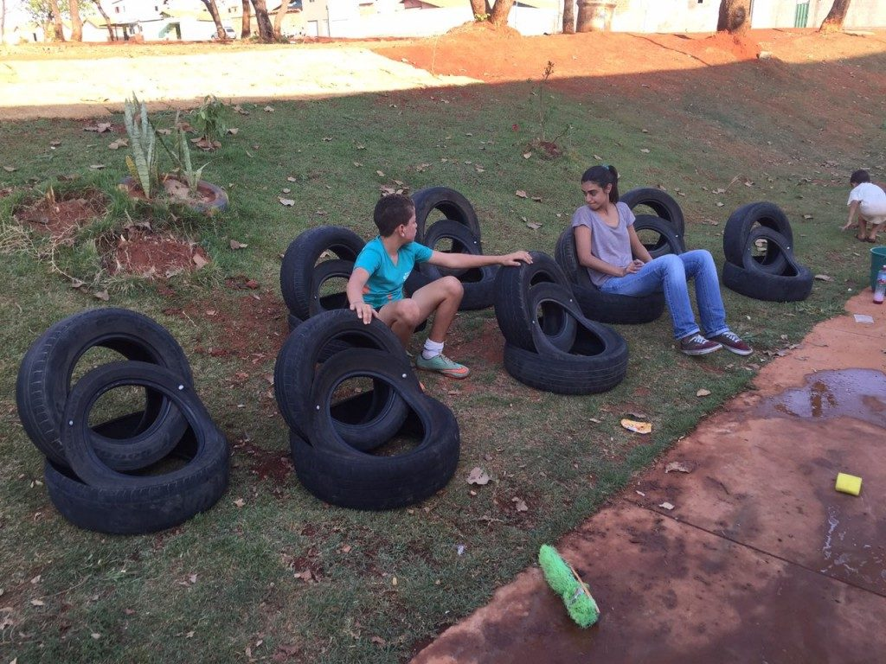

<small>[Texts](../texts.html) | [Lectures](../lectures.html) | [Projects](../projects.html) | [Curations](../curation.html) | [Designs](../designs.html) | [Teachings](../teachings.html) | [Awards](../awards.html) | <a href="https://readruiz.medium.com/" target="_blank">Blog</a></small>

# LabCEUs

Co-orientation of Federal University of Pernambuco Extension Program LabCEUS.

    

    

As a result of an agreement between the Ministry of Culture and Federal University of Pernambuco, it happened in 10 small and medium-sized cities in all regions of Brazil. The pilot program developed creative experiments in arts and technology through public calls to local agents at the Unified Art and Sports Center - CEUs present on these municipalities, opening paths for citizens by offering repertoires to change the local reality.

View [project's page](http://inciti.org/projeto/labceus/)
