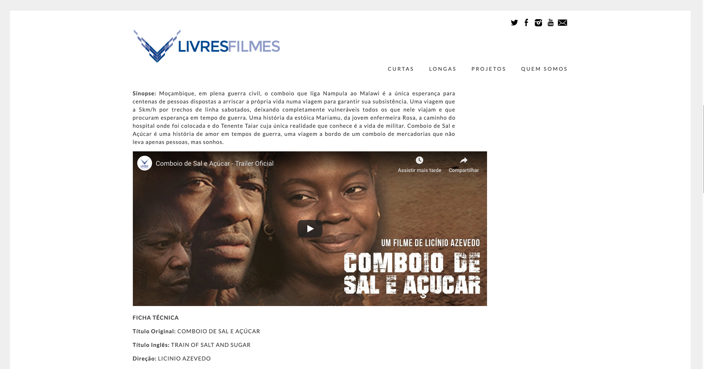

# Livres Filmes

Web Development for Livres Filmes

- 
    
- 
    
- 
    

Livres Filmes is a Brazilian film distribution company whose mission is to work alongside the cultural cinema niche, seeking independent and non-commercial productions, using the cultural circuit of movie theaters, broadcasting platforms and TVs.

Visit [http://livresfilmes.com](http://livresfilmes.com)
