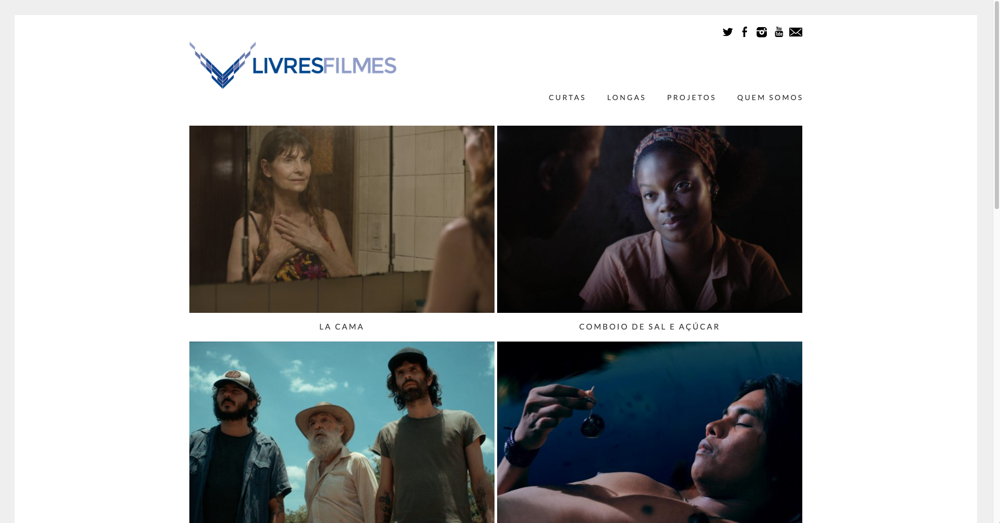
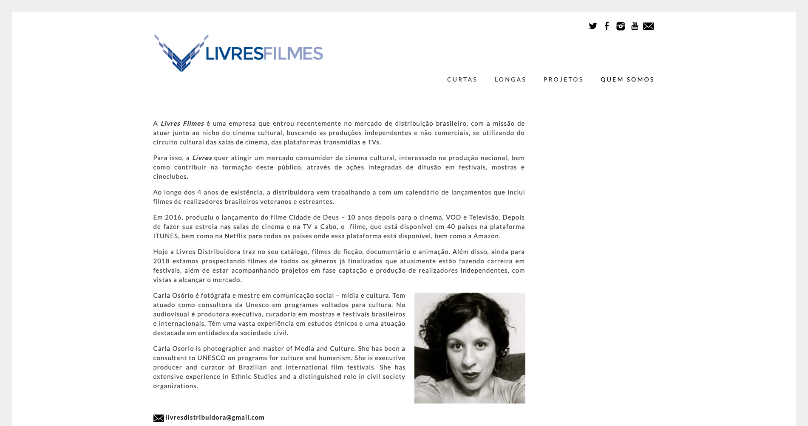
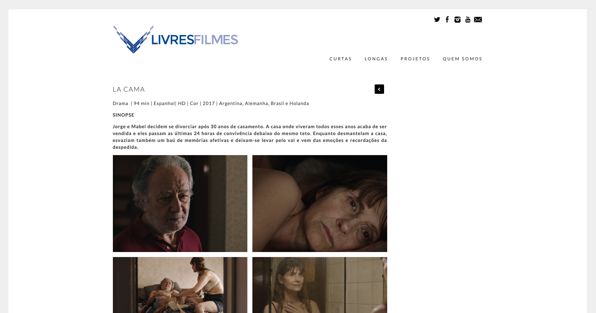

<small>[Texts](../texts.html) | [Lectures](../lectures.html) | [Projects](../projects.html) | [Curations](../curation.html) | [Designs](../designs.html) | [Teachings](../teachings.html) | [Awards](../awards.html) | <a href="https://readruiz.medium.com/" target="_blank">Blog</a></small>

# Livres Filmes

Web Development for Livres Filmes

    

    

Livres Filmes is a Brazilian film distribution company whose mission is to work alongside the cultural cinema niche, seeking independent and non-commercial productions, using the cultural circuit of movie theaters, broadcasting platforms and TVs.

Visit [http://livresfilmes.com](http://livresfilmes.com)
