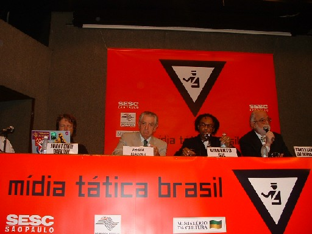
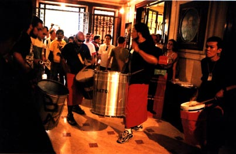

<small>[Projects](../projects.html) | [Lectures](../lectures.html) | [Teachings](../teachings.html) | [Designs](../designs.html) | [Texts](../texts.html) | [Curation](../curation.html) | [Awards](../awards.html) | <a href="https://readruiz.medium.com/" target="_blank">Blog</a></small>

Co-production of the festival held at Casa das Rosas in 2003 bringing together dozens of groups and thousands of people.

- 
    
- 
    
- 
    
- 
    

Independently organized through an open discussion list, the festival took place in spaces such as the low-income suburb areas, Foundations, Cultural Center (SEC), and a public museum (Casa das Rosas). Extension of the dutch meeting The Next Five Minutes (N5M) that popularized the concept of tactical media through the experiences of free radio, blogs, independent publications, art-science, cyberfeminism, and video activism from around the world.

Visit [project's page](https://midiatatica.info/blog/2018/10/16/midia-tatica-brasil/)
