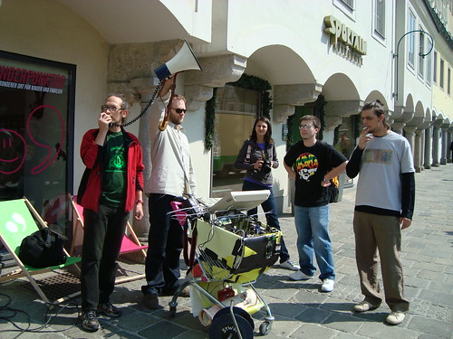
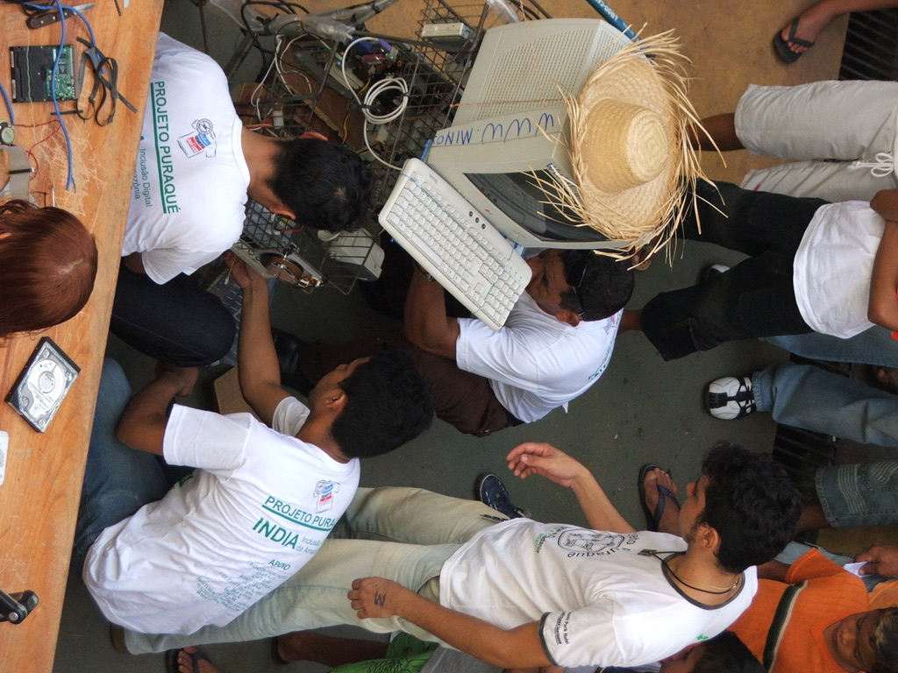
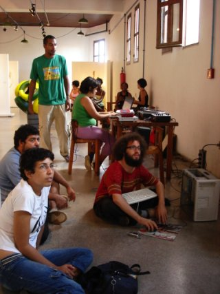
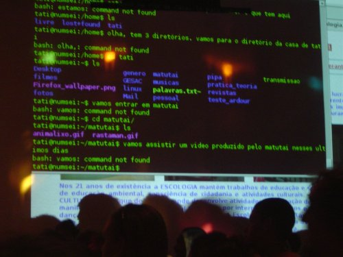

<small>[Texts](../texts.html) | [Lectures](../lectures.html) | [Projects](../projects.html) | [Curations](../curation.html) | [Designs](../designs.html) | [Teachings](../teachings.html) | [Awards](../awards.html) | <a href="https://readruiz.medium.com/" target="_blank">Blog</a></small>

# mimoSa

Project Manager of the Creative Commons Arts Project mimoSa - Supported by Andy Warhol Foundation for the Visual Arts

    

    

    

    

“mimoSa: Urban Intervention and Information Correctional Machine” believes in the concept that people start to think critically about media when they produce and distribute it themselves. In Brazil, new systems of media production and distribution are crucial to achieving a more just distribution of power and representation. “mimoSa” is a continuous workshop that moves around Brazilian cities collecting people’s stories using recycled and reconstructed technologies. The workshops aim to design a machine capable of altering the Brazilian mediascape.

visit project's [blog](https://web.archive.org/web/20090329063958/http://turbulence.org/Works/mimoSa/blog/#expand) and [awarded](https://web.archive.org/web/20100616030103/http://turbulence.org/Works/mimoSa/mimosa_ing/) website
