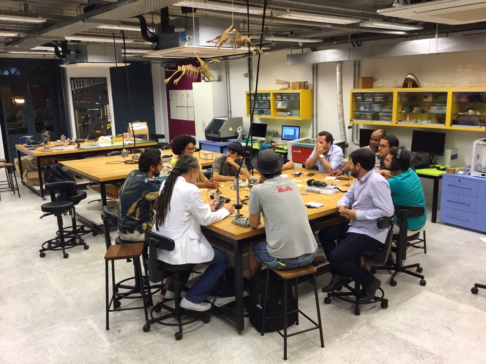
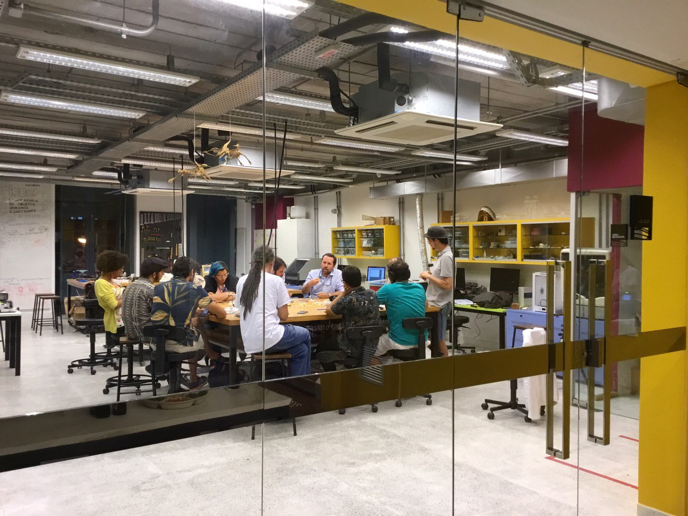
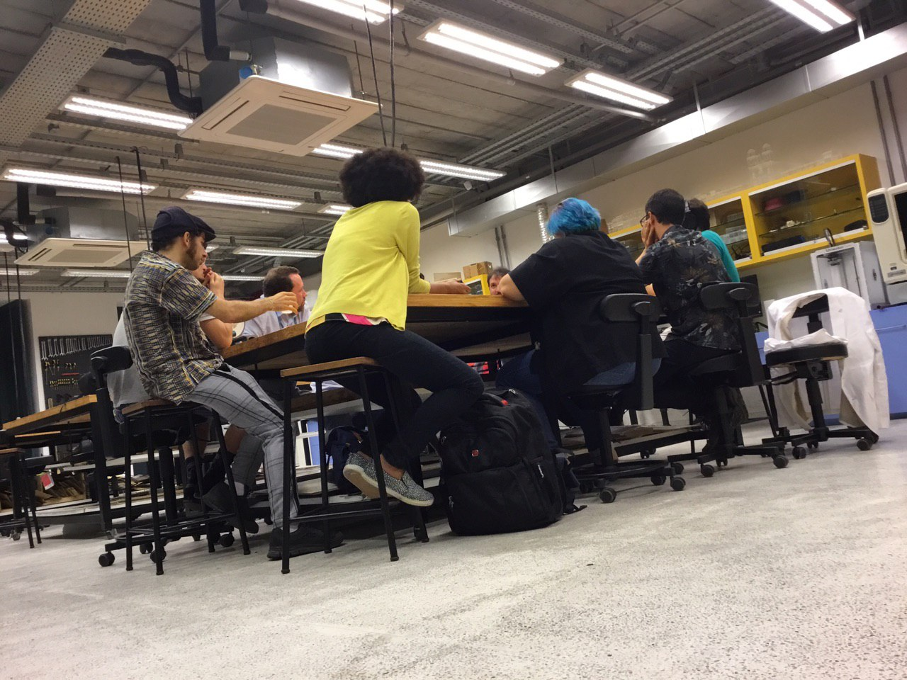
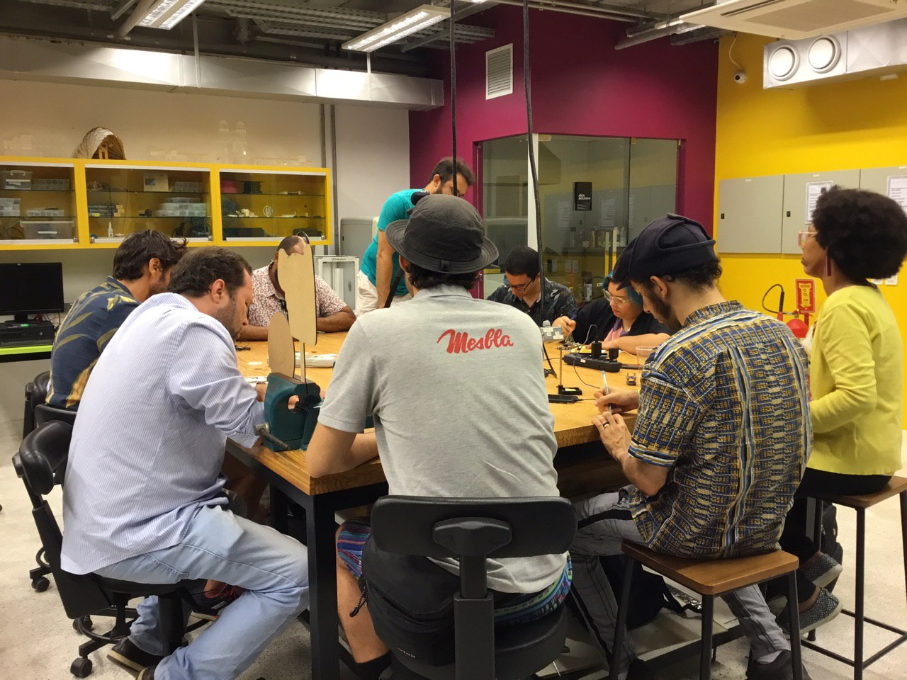

<small>[Texts](../texts.html) | [Lectures](../lectures.html) | [Projects](../projects.html) | [Curations](../curation.html) | [Designs](../designs.html) | [Teachings](../teachings.html) | [Awards](../awards.html) | <a href="https://readruiz.medium.com/" target="_blank">Blog</a></small>

# Mozilla Re-imagine Open

Local production and moderation of a public debate part of Mozilla Internet Health Program

</a>
    
</a>
    
</a>
    
</a>
    

[Reimagine Open](https://blog.mozilla.org/internetcitizen/2019/03/26/is-the-future-of-the-web-open/) was a Mozilla open question to the community across the globe to imagine better futures for our digital lives. As part of a Global Innovation Gathering - GIG efforts to bring to the table partners from the Global South, Brazilian edition happened together with Cameroon, Rwanda, and India about the state of the web.

Discover what we [learnt!](https://www.globalinnovationgathering.org/2019/09/27/an-update-on-reimagine-open/)
