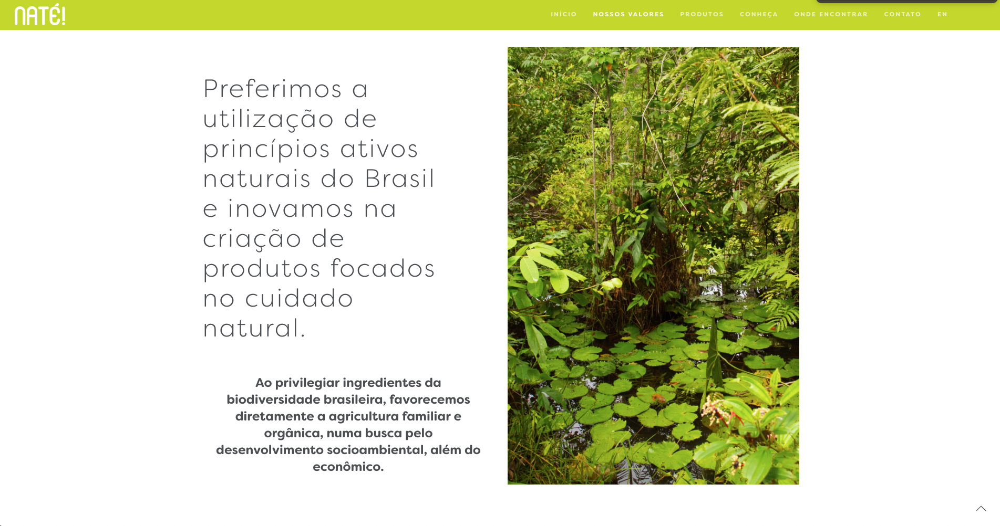
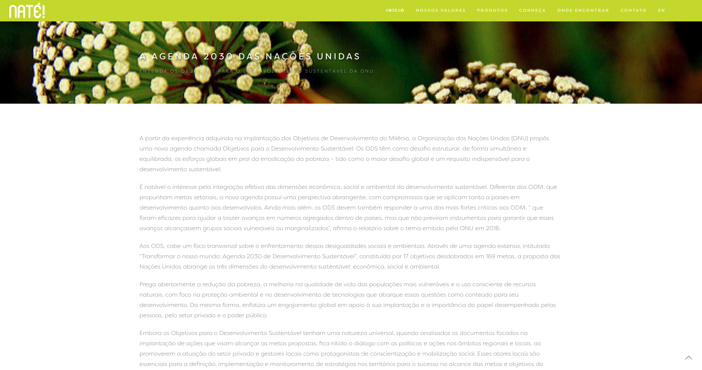
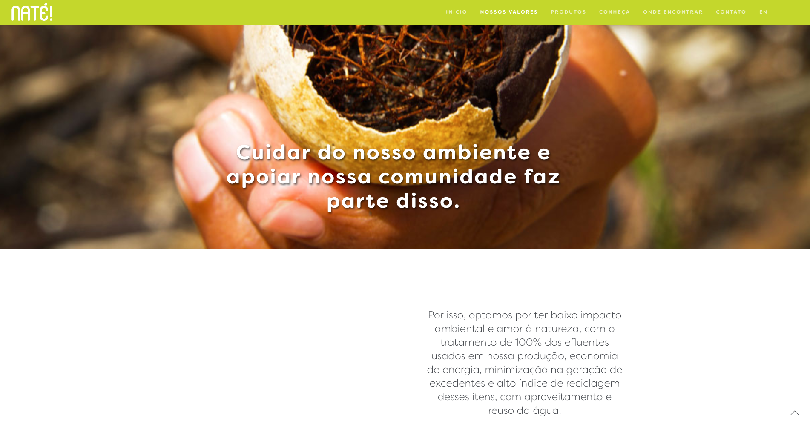

<small>[Texts](../texts.html) | [Lectures](../lectures.html) | [Projects](../projects.html) | [Curations](../curation.html) | [Designs](../designs.html) | [Teachings](../teachings.html) | [Awards](../awards.html) | <a href="https://readruiz.medium.com/" target="_blank">Blog</a></small>

# Naté! Beauty

    

    

    

    

NATÉ! is a Natural Ingredients Industry from the Amazon Rain Forest that emboldens the spread of traditional knowledge encouraging its valorisation and preservation, confident of its importance to biodiversity. Visit [http://natebeauty.com/](http://natebeauty.com/)
