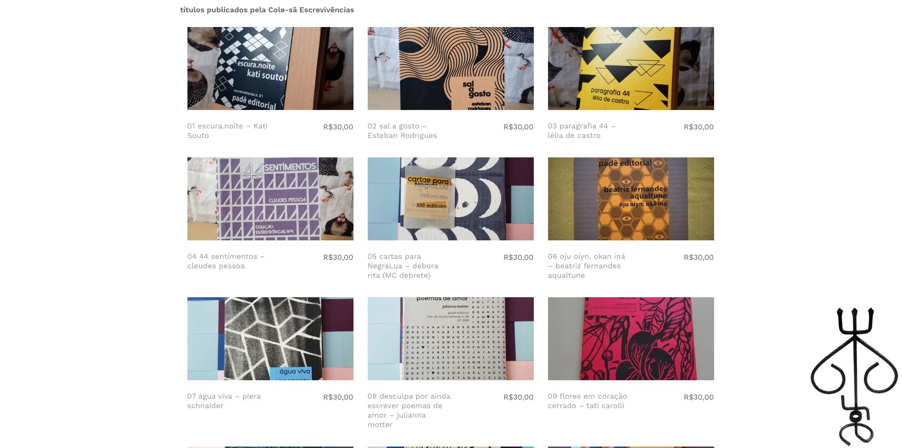
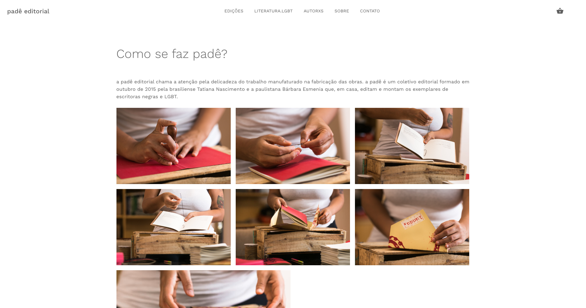
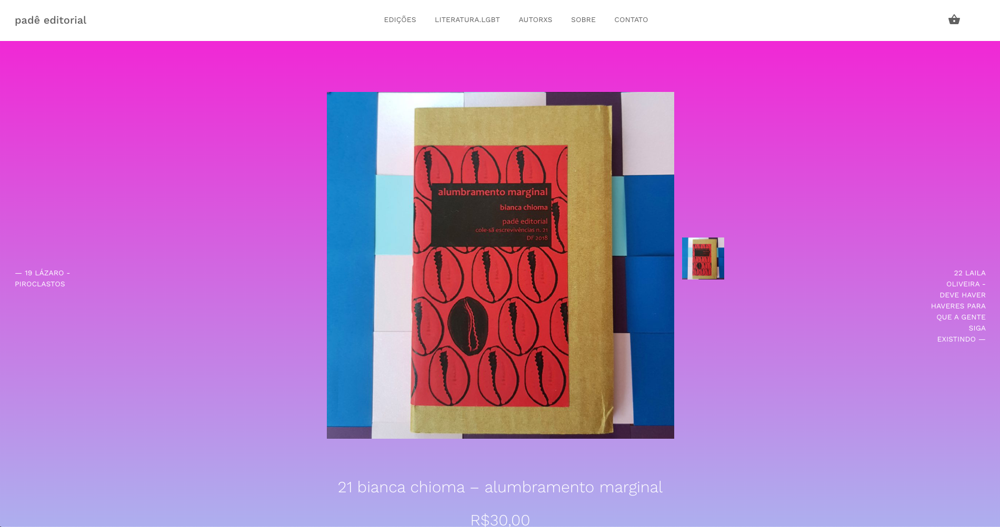

<small>[Texts](../texts.html) | [Lectures](../lectures.html) | [Projects](../projects.html) | [Curations](../curation.html) | [Designs](../designs.html) | [Teachings](../teachings.html) | [Awards](../awards.html) | <a href="https://readruiz.medium.com/" target="_blank">Blog</a></small>

# Padê Editorial

Web development and design for the Pade Editorial virtual store.

    

    

    

    

Padê is an editorial collective that publishes handmade books of black, peripheral, lesbian, transvestite, transsexual and bisexual people in small print

Visit [http://pade.lgbt](http://pade.lgbt)
