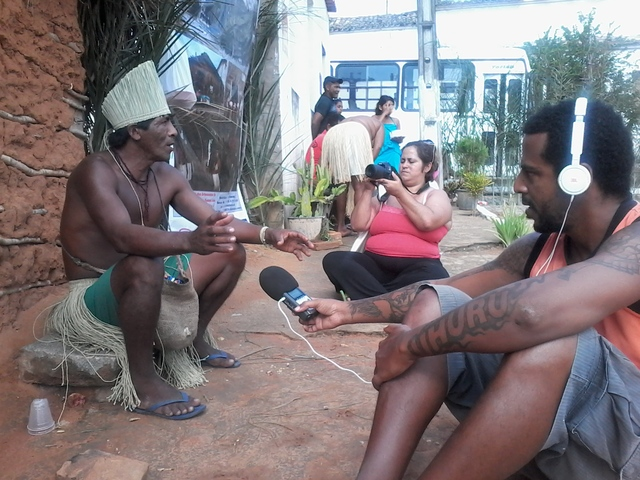
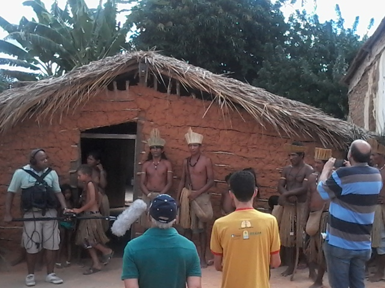
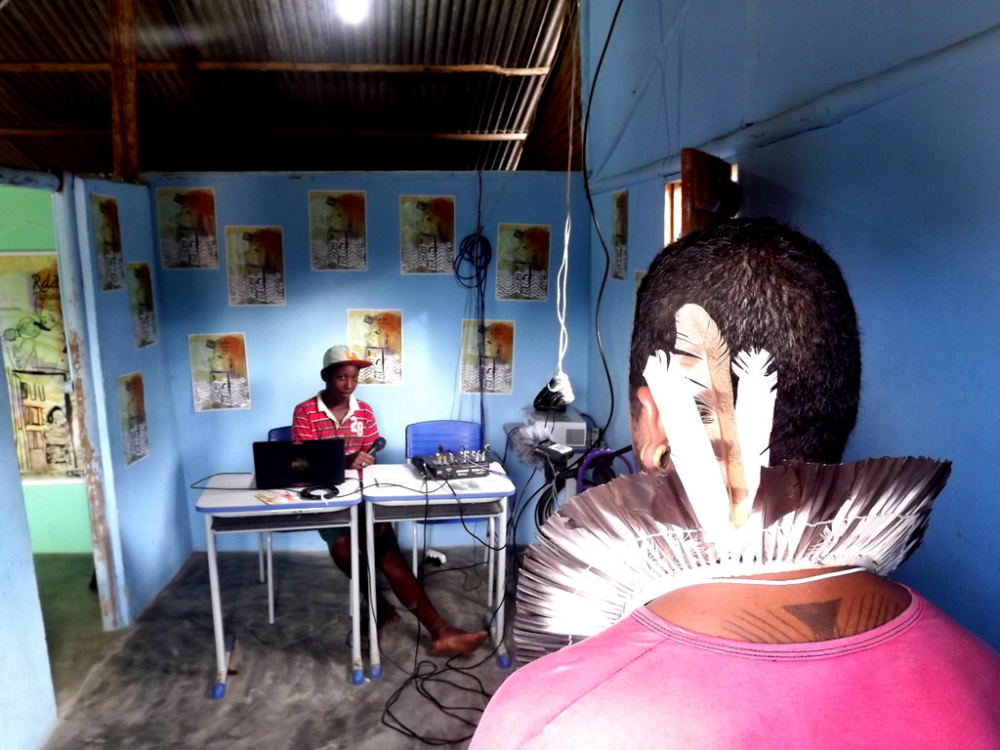

<small>[Projects](../projects.html) | [Lectures](../lectures.html) | [Teachings](../teachings.html) | [Designs](../designs.html) | [Texts](../texts.html) | [Curation](../curation.html) | [Awards](../awards.html) | <a href="https://readruiz.medium.com/" target="_blank">Blog</a></small>

Co-development of free radios and free web service initiative for indigenous and traditional communities from Brazil's northeast.

- 
    
- 
    
- 
    
- 
    

Amnesia is a collaborative network of free FM radios, web sites  
and itinerant radio experiences that believe in access to information production and dissemination as a tool to conquer the basic rights of life in society, especially for indigenous communities and traditional peoples.

https://www.youtube.com/watch?v=4CXJ5f1A7TQ&feature=emb\_title

Visit [project's website](http://radioamnesia.org).
