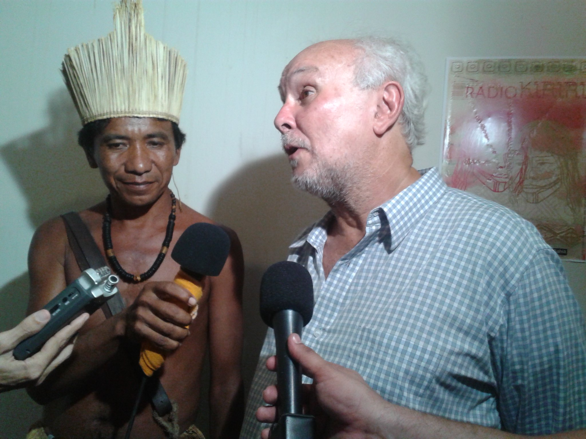

<small>[Texts](../texts.html) | [Lectures](../lectures.html) | [Projects](../projects.html) | [Curations](../curation.html) | [Designs](../designs.html) | [Teachings](../teachings.html) | [Awards](../awards.html) | <a href="https://readruiz.medium.com/" target="_blank">Blog</a></small>

# Radio Amnésia

Co-development of free radios and free web service initiative for indigenous and traditional communities from Brazil's northeast.

<iframe width="560" height="315" src="https://www.youtube.com/embed/4CXJ5f1A7TQ?si=Alme5txHrprM4VYA" title="YouTube video player" frameborder="0" allow="accelerometer; autoplay; clipboard-write; encrypted-media; gyroscope; picture-in-picture; web-share" referrerpolicy="strict-origin-when-cross-origin" allowfullscreen></iframe>

Amnesia was a collaborative network of free FM radios, web sites and itinerant radio experiences that believe in access to information production and dissemination as a tool to conquer the basic rights of life in society, especially for indigenous communities and traditional peoples.

    

    

    

    
