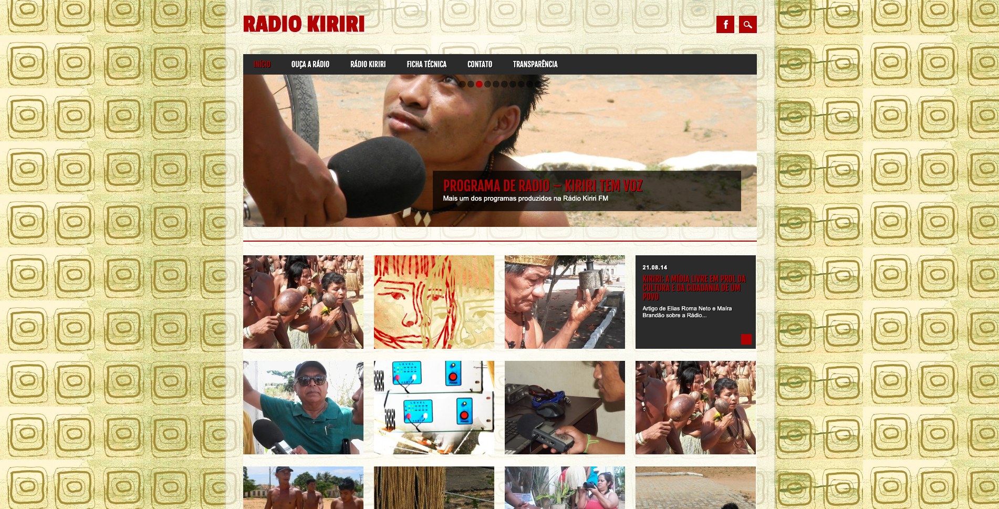
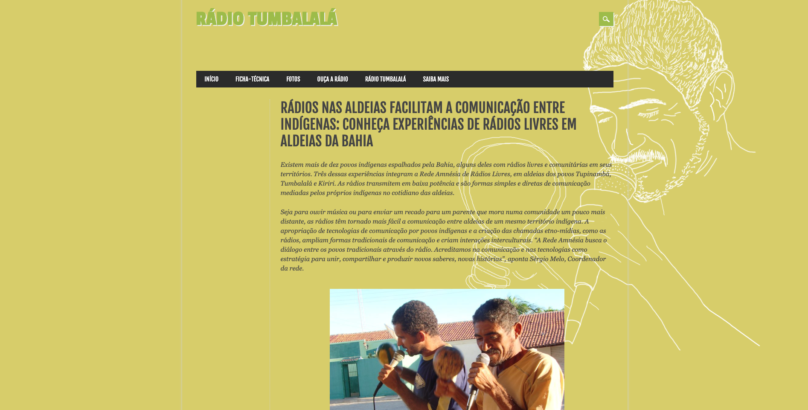
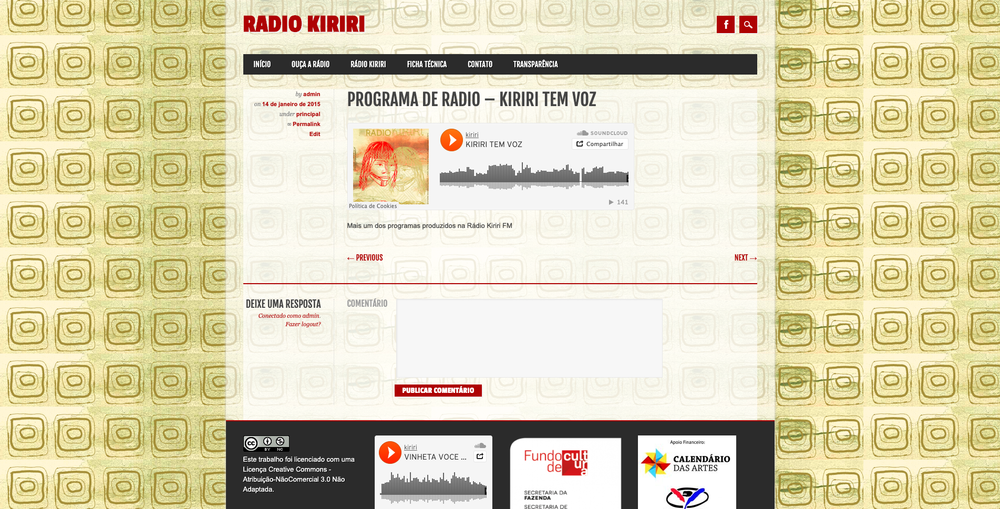
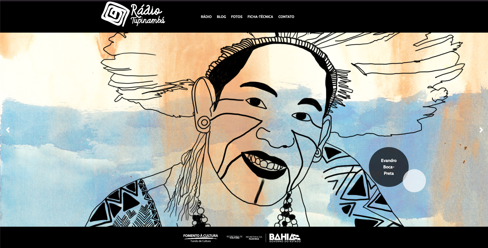

<small>[Texts](../texts.html) | [Lectures](../lectures.html) | [Projects](../projects.html) | [Curations](../curation.html) | [Designs](../designs.html) | [Teachings](../teachings.html) | [Awards](../awards.html) | <a href="https://readruiz.medium.com/" target="_blank">Blog</a></small>

# Rede Amnesia de Radios

Web Development for the network of Indigenous Radios Amnesia FM

    

    

    

    

Radio Amnésia was an Indigenous Communities Free FM Radio Network experience for 15 years.

