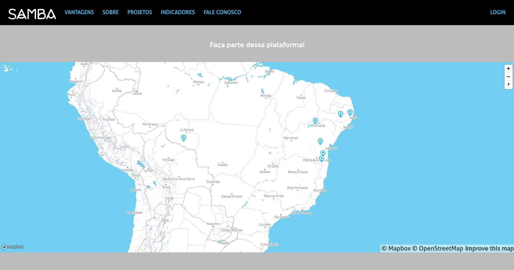
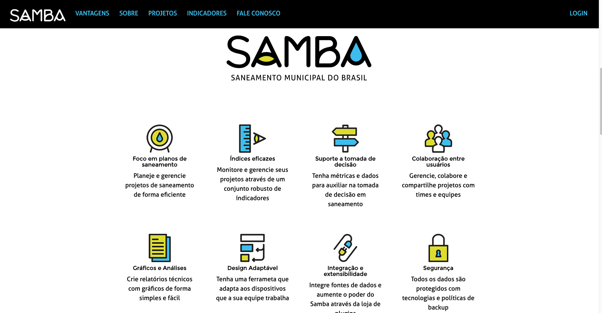
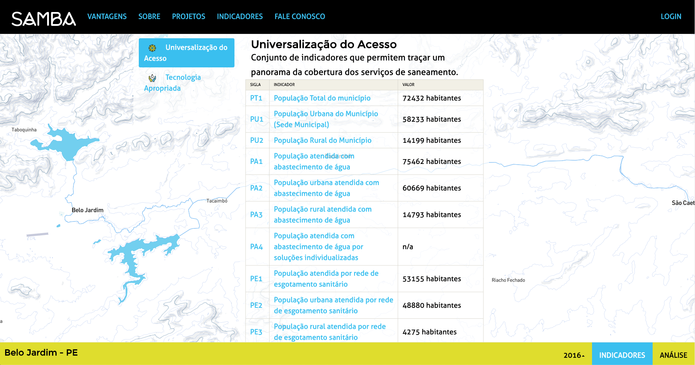

<small>[Texts](../texts.html) | [Lectures](../lectures.html) | [Projects](../projects.html) | [Curations](../curation.html) | [Designs](../designs.html) | [Teachings](../teachings.html) | [Awards](../awards.html) | <a href="https://readruiz.medium.com/" target="_blank">Blog</a></small>

# SAMBA

Web interface and user experience design for SAMBA - Municipal Sanitation of Brazil collaborative platform

    

    

    

    

Samba is a tool that proposes simplicity and agility in the elaboration of a deep and representative diagnosis of the current situation of basic sanitation services offered in a city.
