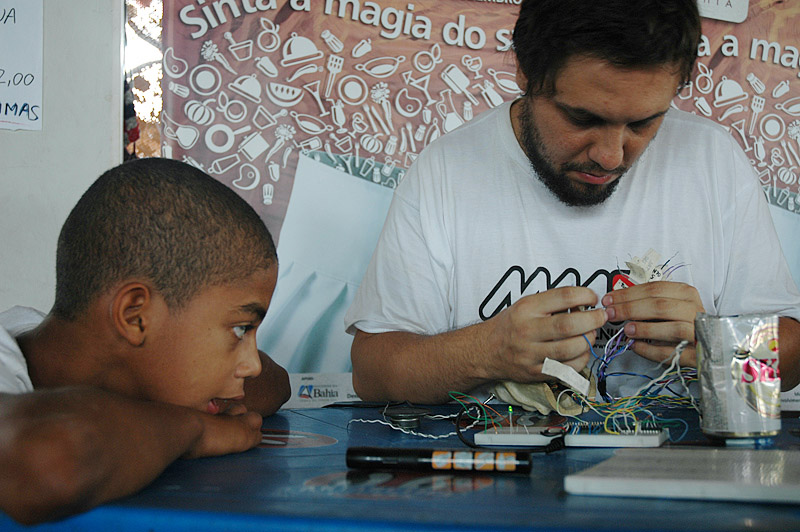
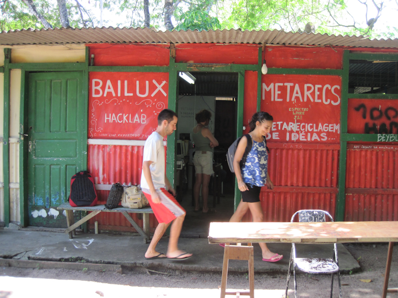
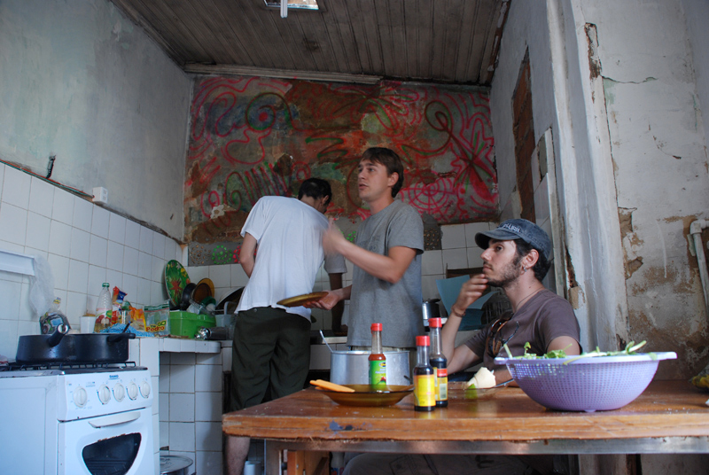
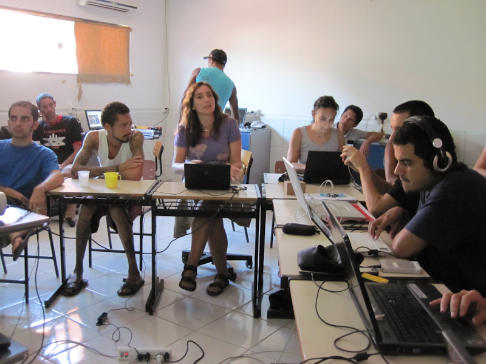

Executive direction of submidialogy conferences serie, held in Campinas (São Paulo), Olinda (Pernambuco), Lençóis, Arraial d'Ajuda (Bahia), Atins (Maranhão) and Paranaguá (Paraná).

- 
    
- 
    
    Fotos Arquivo Karla Brunet
    
- 
    
- 
    
    Fotos Arquivo Karla Brunet
    

Submidialogia aggregate talks, production and collaborative learning, as well as music, free radio, vj and independent media. These are some of the typical “tastes” that could be appreciated - without moderation - during the editions of the conference.

Another characteristic of this festival is to investigate the social, cultural and political possibilities of the digital media, besides fomenting the dialogue (in)existent between theory - the scope of ideas, and the practices - the scope of actions. 

More on [http://submidialogia2.midiatatica.info](http://submidialogia2.midiatatica.info/)
