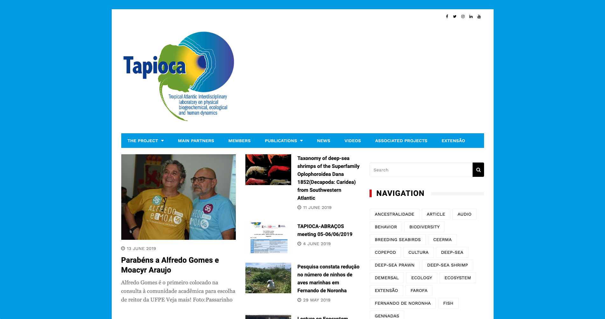
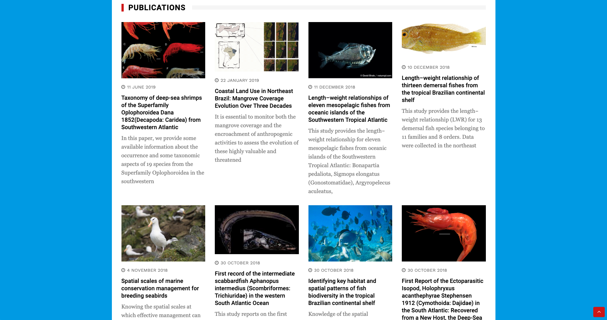
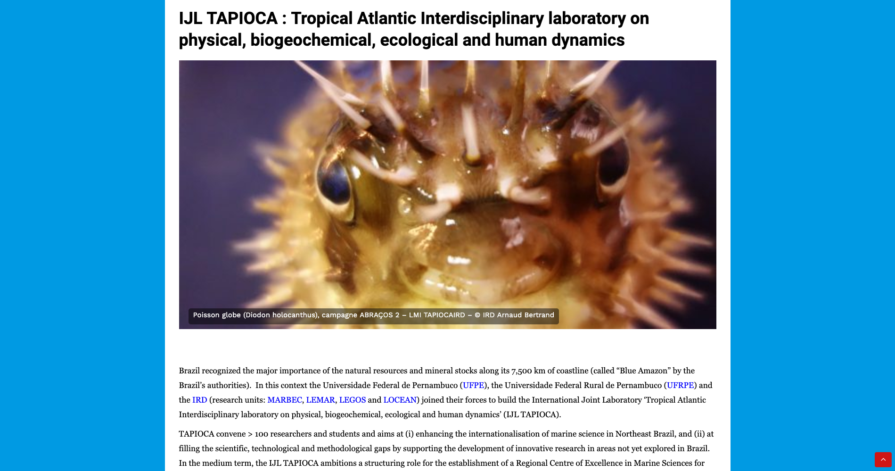
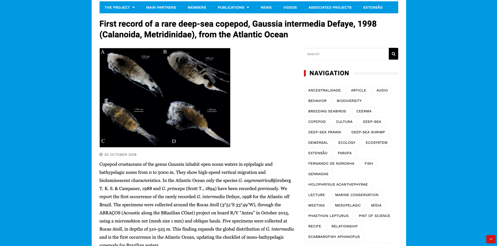

<small>[Texts](../texts.html) | [Lectures](../lectures.html) | [Projects](../projects.html) | [Curations](../curation.html) | [Designs](../designs.html) | [Teachings](../teachings.html) | [Awards](../awards.html) | <a href="https://readruiz.medium.com/" target="_blank">Blog</a></small>

# TAPIOCA

Web Design for Tapioca Research Group (France/Brazil)

    

    

    
</a>
    

TAPIOCA convene more than 100 researchers and students and aims at (i) enhancing the internationalisation of marine science in Northeast Brazil, and (ii) at filling the scientific, technological and methodological gaps by supporting the development of innovative research in areas not yet explored in Brazil. In the medium term, the IJL TAPIOCA ambitions a structuring role for the establishment of a Regional Centre of Excellence in Marine Sciences for the tropical Atlantic at Recife.

Visit [https://tapioca.ird.fr/](https://tapioca.ird.fr/)
