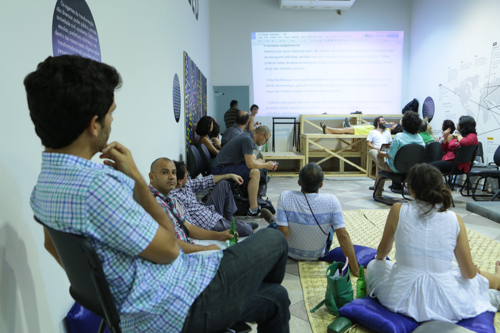
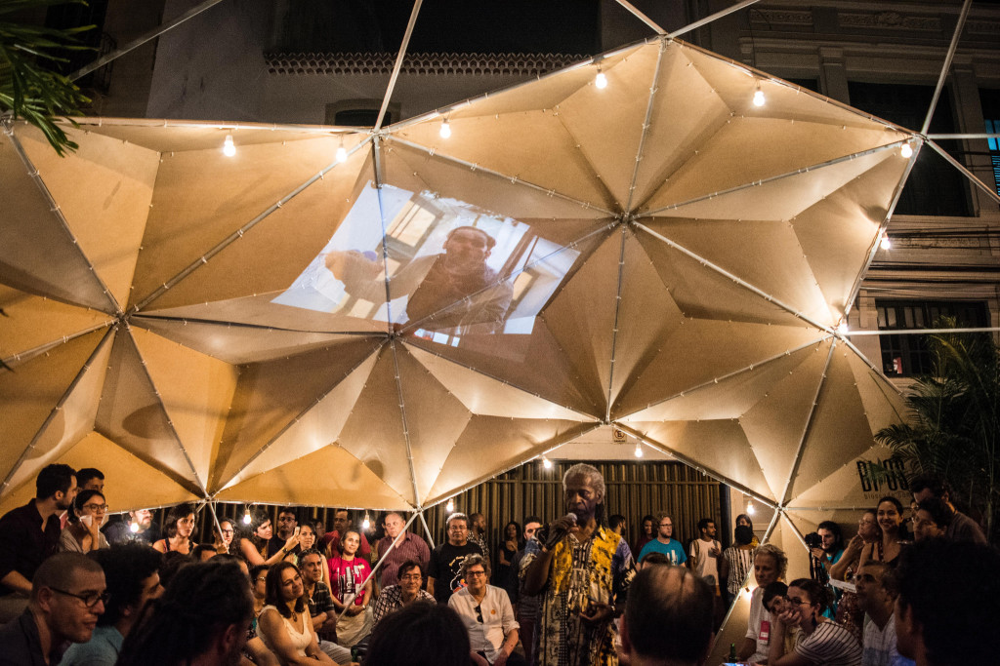
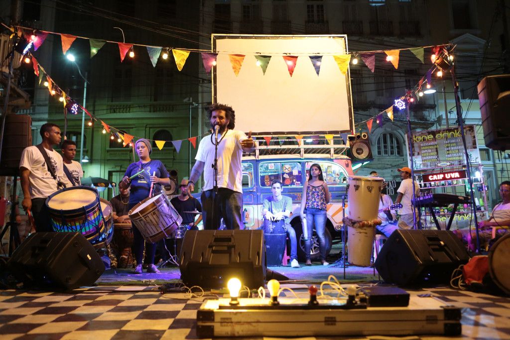
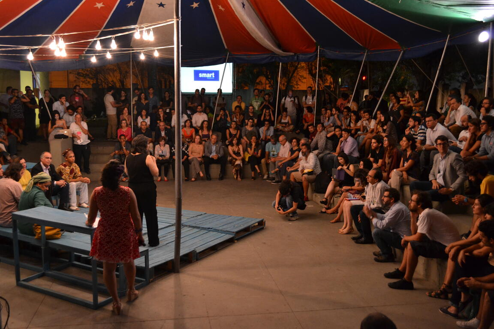

<small>[Texts](../texts.html) | [Lectures](../lectures.html) | [Projects](../projects.html) | [Curations](../curation.html) | [Designs](../designs.html) | [Teachings](../teachings.html) | [Awards](../awards.html) | <a href="https://readruiz.medium.com/" target="_blank">Blog</a></small>

# Urban Thinkers Campus Brazil

Executive Direction for the UN Urban Thinkers Campus Brazil, in Recife (2015). The Urban Thinkers Campus is an initiative of the UN-Habitat global urban campaign, conceived as a critical and open space for exchange between people who believe that urbanisation is an opportunity for positive transformation, as well as for sustainable development.

<iframe width="560" height="315" src="https://www.youtube.com/embed/FbFmUZU9yb4?si=qY4JvISCDw7Ol17a" title="YouTube video player" frameborder="0" allow="accelerometer; autoplay; clipboard-write; encrypted-media; gyroscope; picture-in-picture; web-share" referrerpolicy="strict-origin-when-cross-origin" allowfullscreen></iframe>

Still, it is a forum designed to simulate solutions for the urban future and build consensus among the partners involved with the challenges of urbanisation.

    

    

    

For four days, civil society, academia and representatives of the public and private sectors from around the world shared inspiring solutions for social inclusion and the creation of an urban narrative linked to open technologies with a focus on cities as inclusive territories. What is the role of cities as networks of learning spaces, especially for young people?

<iframe width="560" height="315" src="https://www.youtube.com/embed/eJa8ZADTSMU?si=xDAWuIfv4-alUFcp" title="YouTube video player" frameborder="0" allow="accelerometer; autoplay; clipboard-write; encrypted-media; gyroscope; picture-in-picture; web-share" referrerpolicy="strict-origin-when-cross-origin" allowfullscreen></iframe>
