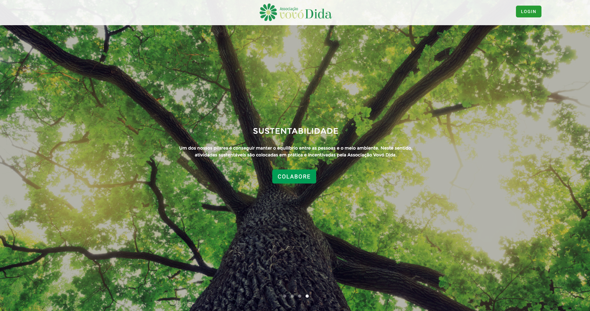
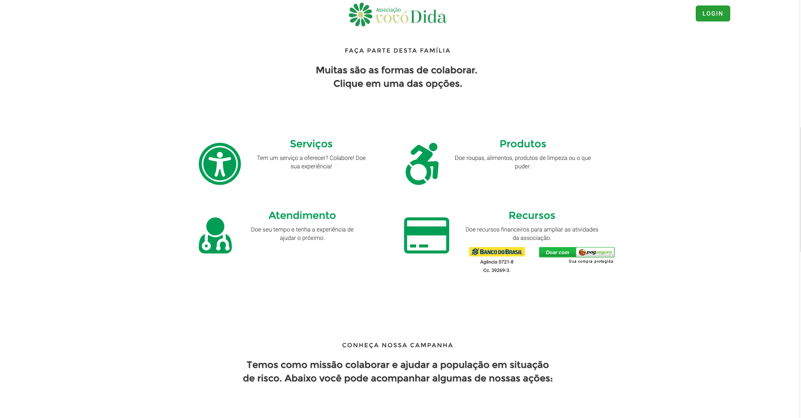
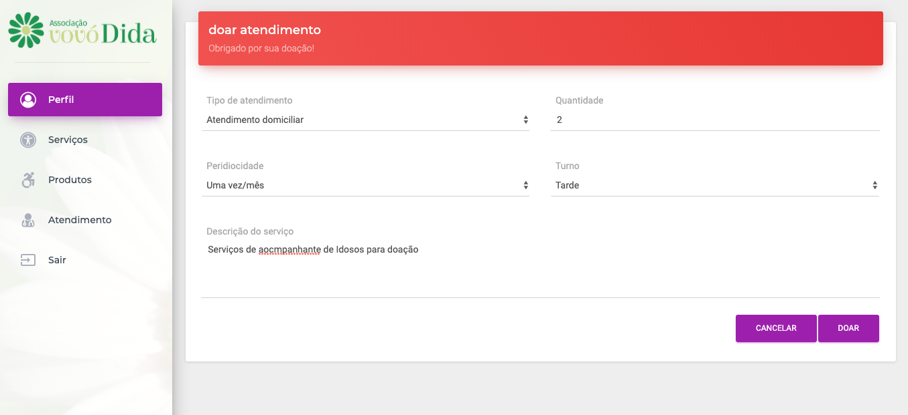
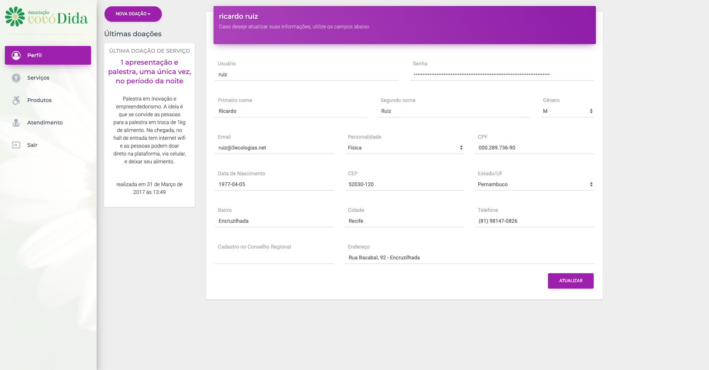

<small>[Texts](../texts.html) | [Lectures](../lectures.html) | [Projects](../projects.html) | [Curations](../curation.html) | [Designs](../designs.html) | [Teachings](../teachings.html) | [Awards](../awards.html) | <a href="https://readruiz.medium.com/" target="_blank">Blog</a></small>

# Vovó Dida

Development of user interface and user experience for donations platform to Vovó Dida Charitable Association

    

    

    

Vovó Dida Charitable Association develops socio-educational and cultural actions that stimulate love and solidarity through a network of health care and care for the people.

Visit [http://www.vovodida.org.br/](http://www.vovodida.org.br/)
