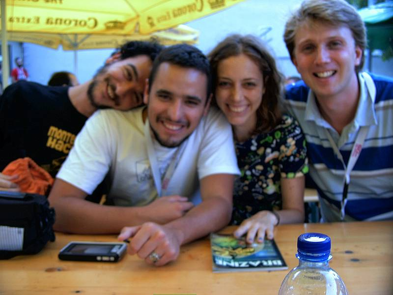

<small>[Texts](../texts.html) | [Lectures](../lectures.html) | [Projects](../projects.html) | [Curations](../curation.html) | [Designs](../designs.html) | [Teachings](../teachings.html) | [Awards](../awards.html) | <a href="https://readruiz.medium.com/" target="_blank">Blog</a></small>

**mimoSa** - **Urban Intervention and Information Correction Machine**. Panel presenting a residency at Tesla. Berlin, 2006

- 
    
- 
    
- 
    
- 
    

Conclusion of a residency at Tesla by presenting a mapping of Brazilian new media groups, festivals, arts and activism, connecting independent, governmental, community and private initiatives.

Visit [Wizards of OS website](http://www.wizards-of-os.org/programm/specials/mimosa.html)
